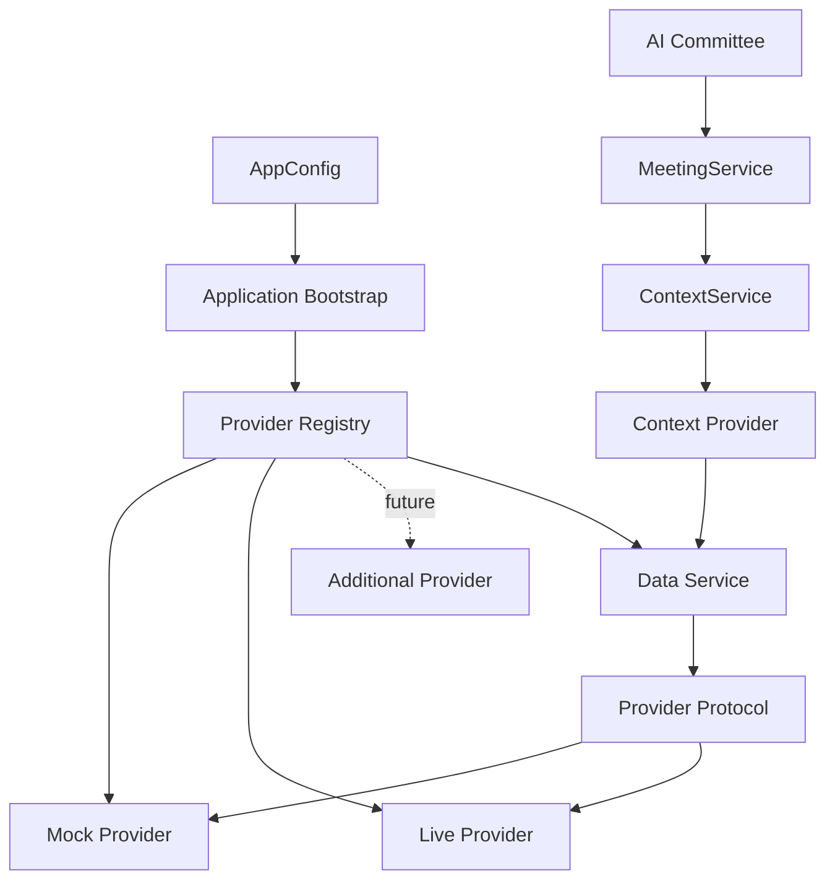

# Data Source Layer Architecture

The Data Source Layer is ParakeetNest's shared architecture for external facts.
It keeps market data, news, filings, macro data, portfolio data, and calendars
behind the same shape: provider-specific adapters normalize source payloads,
services expose provider-neutral operations, context providers adapt facts into
meeting context, and the committee receives rendered evidence.

This layer is an architectural pattern, not one Python package. Each data family
keeps its own package, models, provider contract, registry, service, tests, and
context adapter while following the same dependency direction.

## Core Principle

External sources are allowed at the edge of the system only.

Committee agents, decision policy, memory, reports, and context assembly should
not import provider SDKs, HTTP clients, raw vendor payloads, or provider-specific
exceptions. They depend on provider-neutral models and services.

## Layer Diagram



```text
AppConfig
  -> provider registry
  -> provider protocol
  -> data service
  -> context provider
  -> ContextService
  -> MeetingService
  -> AI Committee
```

## Provider Pattern

A provider is the only object that knows how to talk to a concrete external
source. It owns vendor SDK imports, HTTP behavior, authentication mechanics,
payload parsing, source quirks, retry rules, and provider-specific error
mapping.

Every provider-backed data family should define:

- a small provider protocol;
- provider-neutral request and response models;
- one deterministic mock provider;
- optional live providers selected by configuration;
- provider-neutral errors or mapped domain errors;
- tests that do not require live network access by default.

Providers must convert vendor payloads into internal models before data crosses
the provider boundary. Provider-specific exceptions must be translated into
provider-neutral errors or safe service results.

Current examples:

- `MarketDataProvider` normalizes quotes and price history.
- `NewsProvider` normalizes source-attributed articles.
- `SecFilingProvider` normalizes filing metadata and content requests.
- `FinancialStatementProvider` normalizes income statements, balance sheets,
  cash flow statements, and fiscal periods.
- `MacroDataProvider` normalizes economic indicators, observations, series, and
  snapshots.

Future examples:

- `PortfolioProvider` for account and position snapshots.
- `CalendarProvider` for earnings, dividends, and events.

## Registry Pattern

A registry maps stable provider IDs to provider factories. It is a bootstrap
boundary, not a business workflow engine.

Registry responsibilities:

- register provider factories under stable IDs such as `mock` or `yahoo`;
- reject duplicate provider IDs;
- resolve the configured provider ID;
- fail early for unknown provider IDs;
- keep application bootstrap free of provider-specific conditionals.

Registry non-responsibilities:

- provider fallback;
- ranking;
- deduplication;
- caching;
- retry orchestration;
- request-level provider composition.

Those behaviors belong in the service layer if the product needs them.

## Service Pattern

A data service is the application entry point for one data family. It depends on
the provider protocol, not on concrete providers.

Service responsibilities:

- expose provider-neutral operations to callers;
- validate request shape where appropriate;
- delegate retrieval to the configured provider;
- provide a future home for fallback, caching, deduplication, ranking,
  freshness policy, and metrics;
- keep callers unaware of provider selection details.

Service non-responsibilities:

- importing live provider SDKs;
- rendering committee prompts;
- calling LLMs;
- writing directly to SQLite unless an explicit persistence adapter is part of a
  later workflow;
- executing trades.

Current examples:

- `MarketDataService`
- `NewsService`
- `SecFilingService`
- `FinancialStatementService`
- `MacroDataService`

## Context Provider Pattern

A context provider adapts one data service into `MeetingContext`.

Context provider responsibilities:

- inspect `ContextRequest`;
- decide whether the provider can contribute through `supports(request)`;
- call a provider-neutral data service;
- map service models into the appropriate `MeetingContext` section;
- preserve source, fetched time, warnings, and data quality notes;
- return partial context through `ContextProviderResult`.

Context provider non-responsibilities:

- selecting concrete data providers;
- importing provider registries;
- fetching raw vendor payloads directly;
- calling LLMs;
- mutating memory or persistence.

This keeps `ContextService` as an assembly layer and prevents it from becoming a
source-specific fetching layer.

## Data Flow

```text
User or scheduled research request
  -> MeetingService
  -> ContextRequest
  -> ContextService
  -> enabled ContextProvider objects
  -> data-family service
  -> configured provider protocol
  -> concrete provider
  -> provider-neutral models
  -> partial MeetingContext section
  -> merged MeetingContext
  -> rendered committee prompt context
  -> Xixi, Dongdong, Yoyo, Chairman, Investment Secretary
```

For example, news follows this flow:

```text
ContextRequest.symbols
  -> NewsContextProvider
  -> NewsQuery
  -> NewsService
  -> NewsProvider
  -> MockNewsProvider | YahooFinanceNewsProvider
  -> NewsArticle
  -> NewsContext
  -> MeetingContext.news
```

Market data follows the same flow:

```text
ContextRequest.symbols
  -> MarketContextProvider
  -> MarketDataService
  -> MarketDataProvider
  -> MockMarketDataProvider | YahooFinanceMarketDataProvider
  -> MarketDataSnapshot
  -> MarketContext
  -> MeetingContext.market
```

Financial statements follow the same flow:

```text
ContextRequest.symbols
  -> FinancialStatementContextProvider
  -> FinancialStatementRequest
  -> FinancialStatementService
  -> FinancialStatementProvider
  -> MockFinancialStatementProvider
  -> FinancialStatementBundle
  -> FinancialStatementSnapshot
  -> MeetingContext.financials
```

Macro data follows the same flow:

```text
ContextRequest.include_macro
  -> MacroContextProvider
  -> MacroDataService
  -> MacroDataProvider
  -> MockMacroDataProvider
  -> MacroSnapshot
  -> MeetingContext.macro
```

## Dependency Direction

Dependencies point inward from concrete infrastructure toward provider-neutral
application boundaries:

```text
Concrete provider
  -> provider protocol and provider-neutral models
  -> service
  -> context provider
  -> ContextService
  -> MeetingService
  -> committee runtime
```

Allowed direction:

- application bootstrap imports concrete providers and registries;
- registries return provider protocol implementations;
- services depend on provider protocols;
- context providers depend on services;
- committee workflows depend on context, not provider packages.

Forbidden direction:

- committee importing concrete providers or provider SDKs;
- context service importing provider registries;
- services importing provider-specific SDKs outside concrete provider modules;
- providers calling LLMs or mutating memory;
- data-source layers executing trades.

## Extension Model

To add a new external data source family:

1. Create a dedicated package for the data family.
2. Define provider-neutral models and requests.
3. Define a small provider protocol.
4. Add a deterministic mock provider.
5. Add optional live provider adapters behind the same protocol.
6. Add a registry with stable provider IDs.
7. Add a service that depends only on the provider protocol.
8. Add a context provider that adapts the service into `MeetingContext`.
9. Wire the registry, selected provider, service, and context provider in
   application bootstrap.
10. Add tests for models, provider behavior, registry behavior, service
    behavior, context integration, error mapping, and import boundaries.

This extension path keeps future Epics small, testable, and consistent with the
memory-first committee architecture.

## Current Status

Completed provider-backed data families:

- Market Data Layer: mock and Yahoo Finance providers.
- News Layer: mock and Yahoo Finance news providers.
- SEC Filing Layer: mock and SEC EDGAR providers.
- Financial Statement Layer: mock provider.
- Macro Layer: mock provider.

Planned provider-backed data families:

- Portfolio Layer.
- Calendar Layer.
