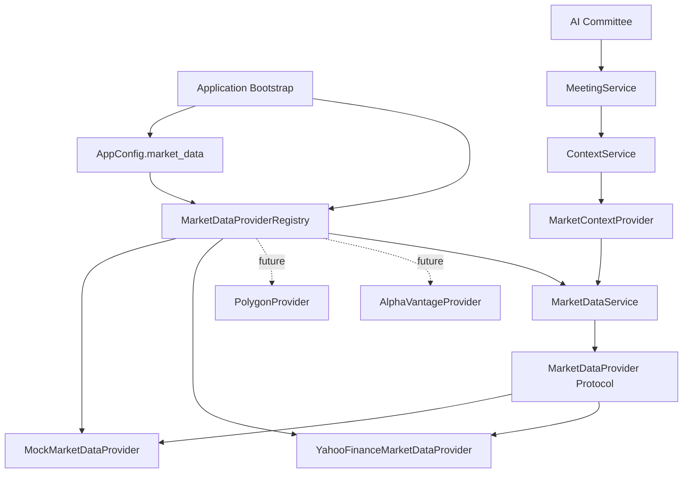
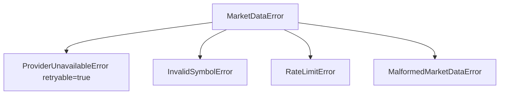

# Market Data Layer Architecture

The Market Data Layer is ParakeetNest's provider-agnostic boundary for quotes
and historical bars. It gives the Context Layer one internal language for
market facts before those facts enter committee memory and reasoning.

The committee never talks to Yahoo Finance, Polygon, Robinhood, AlphaVantage,
or any other market provider directly. Committee agents receive prepared
`MeetingContext`; they do not know which vendor supplied a price, how a vendor
names a symbol, which API failed, or whether data came from deterministic
fixtures during tests.

## Layer Diagram



```text
Application Bootstrap
  -> AppConfig.market_data.provider
  -> MarketDataProviderRegistry
  -> MarketDataService
  -> MarketDataProvider
  -> MockMarketDataProvider | YahooFinanceMarketDataProvider
  -> MarketContextProvider
  -> ContextService
  -> MeetingService
  -> AI Committee
```

## Provider Abstraction

`MarketDataProvider` is the provider contract in
`src/parakeetnest/market_data/provider.py`. It is intentionally small:

- `supports(symbol)`: checks whether the provider can serve the symbol.
- `get_snapshot(symbol)`: returns a current `MarketDataSnapshot`.
- `get_price_history(symbol, range)`: returns historical `PriceBar` values.

The service, context, and committee layers depend on this protocol, not on
`yfinance` or any other provider SDK. Provider-specific authentication,
payloads, timestamp quirks, rate limits, and exceptions stay inside concrete
provider modules.

`ProviderError` remains a backward-compatible alias for `MarketDataError`.
`ProviderCapability` remains part of the public provider abstraction for callers
that need provider-neutral capability names.

## Domain Models

Domain models live in `src/parakeetnest/market_data/models.py`. They are
provider-neutral and immutable where appropriate.

- `Symbol`: normalized ticker with optional exchange and market metadata.
- `AssetType`: provider-independent asset class enum.
- `MarketDataSnapshot`: point-in-time quote data for one symbol.
- `PriceBar`: OHLCV data for one historical interval.
- `MarketDataRange`: provider-neutral history request parameters.

Providers must convert vendor payloads into these models before data crosses the
Market Data Layer boundary.

## Registry And Configuration Flow

`AppConfig` owns the selected provider ID:

```yaml
market_data:
  provider: mock
```

The default provider is `mock`. To use live Yahoo data:

```yaml
market_data:
  provider: yahoo
```

At application bootstrap:

1. `create_market_data_provider_registry()` registers provider factories.
2. `MarketDataProviderRegistry.resolve(config.market_data.provider)` creates
   the configured provider.
3. The resolved provider is passed to `MarketDataService`.
4. `MarketContextProvider` receives only the service, not a concrete provider.

Unknown provider IDs raise `ConfigurationError` with the configured value and
the available provider IDs. Provider selection belongs in the registry; callers
should not add provider-specific conditionals.

## Error Hierarchy

Market data failures use provider-independent exceptions from
`src/parakeetnest/market_data/errors.py`:



- `MarketDataError`: base class for market data domain failures.
- `ProviderUnavailableError`: transient or operational provider failure.
- `InvalidSymbolError`: invalid, unsupported, missing, or delisted symbol.
- `RateLimitError`: provider rate limit or quota block.
- `MalformedMarketDataError`: empty, missing, or malformed provider payload.

Providers must translate third-party exceptions before they cross the provider
boundary. `yfinance`, pandas, requests, socket, HTTP, and other provider-specific
exceptions must not reach `MarketDataService`, the Context Layer, or the
committee.

## Retry Policy

Retry behavior is provider-owned in v1. The Yahoo provider retries only
transient provider failures such as timeouts, temporary network failures, and
retryable provider unavailable errors.

It does not retry invalid symbols, rate limits, empty responses, malformed
responses, or non-retryable unexpected failures. Empty and malformed data are
data quality failures, not transport failures.

Provider failures are logged with provider name, operation, symbol or symbols,
root cause, and retry attempt when applicable. Expected domain errors are logged
without leaking vendor exception types to callers.

## Provider Responsibilities

Concrete providers are responsible for:

- implementing `MarketDataProvider`.
- normalizing vendor symbols into `Symbol`.
- mapping quote payloads into `MarketDataSnapshot`.
- mapping historical payloads into `PriceBar`.
- converting provider-specific failures into `MarketDataError` subclasses.
- keeping SDK imports and network behavior inside the provider module.
- avoiding automatic trading and hard-coded API keys.

`MockMarketDataProvider` is deterministic and network-free. It is the default
for tests and local development.

`YahooFinanceMarketDataProvider` is the optional live-data adapter selected with
`market_data.provider: yahoo`. It imports `yfinance` lazily and maps Yahoo quote
and history data into ParakeetNest models.

## Service Layer

`MarketDataService` is the application entry point for market data requests. It
checks provider support for a `Symbol` and delegates snapshot or history
requests to the configured provider.

The service depends only on `MarketDataProvider`. It does not import
`YahooFinanceMarketDataProvider`, inspect provider-specific errors, or know how
providers fetch data.

Future cross-provider orchestration belongs in the service layer:

- caching recent snapshots and historical bars.
- provider fallback.
- latency, freshness, and failure metrics.

## Context Layer Integration

`MarketContextProvider` turns requested ticker strings into `Symbol` objects,
asks `MarketDataService` for snapshots, and adapts `MarketDataSnapshot` into
Context Layer models. The AI Committee receives rendered context, not provider
clients or vendor payloads.

This keeps the committee memory-first path independent of data sources:

- market data is normalized before it enters `MeetingContext`.
- provider metadata becomes context metadata and data quality notes.
- replacing a provider does not require prompt, agent, or meeting changes.

## Package Exports

`parakeetnest.market_data` exports the intentional public API:

- domain models.
- provider-independent errors.
- `MarketDataProvider`, `ProviderCapability`, and `ProviderError`.
- `MarketDataProviderRegistry` and default registry factory.
- `MarketDataService`.
- concrete `MockMarketDataProvider` and `YahooFinanceMarketDataProvider`.

Internal helper methods and vendor payload shapes are not exported.

## Testing Strategy

Tests cover the layer at several boundaries:

- model normalization and immutable value objects.
- provider protocol shape and provider-neutral return types.
- mock provider deterministic snapshots and history.
- service delegation and unsupported-symbol behavior.
- registry configuration, default provider selection, and unknown providers.
- Yahoo quote/history mapping without network calls through injected fakes.
- provider-specific exception mapping into `MarketDataError` subclasses.
- retry behavior for transient Yahoo failures.
- import-boundary tests that keep Yahoo Finance dependencies isolated.

Live network tests are intentionally not required for the default suite. The
mock provider keeps `.venv/bin/python -m pytest` deterministic.

## Future Providers

Future providers should implement the same `MarketDataProvider` interface:

- `PolygonProvider` for richer market data APIs and higher quality historical
  data.
- `AlphaVantageProvider` for an additional quote/history source.
- `RobinhoodProvider` only for account-adjacent market data where appropriate;
  ParakeetNest must not implement automatic trading.
