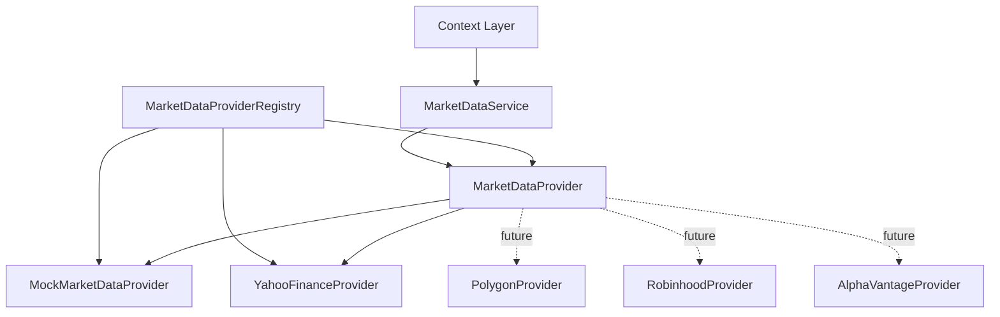
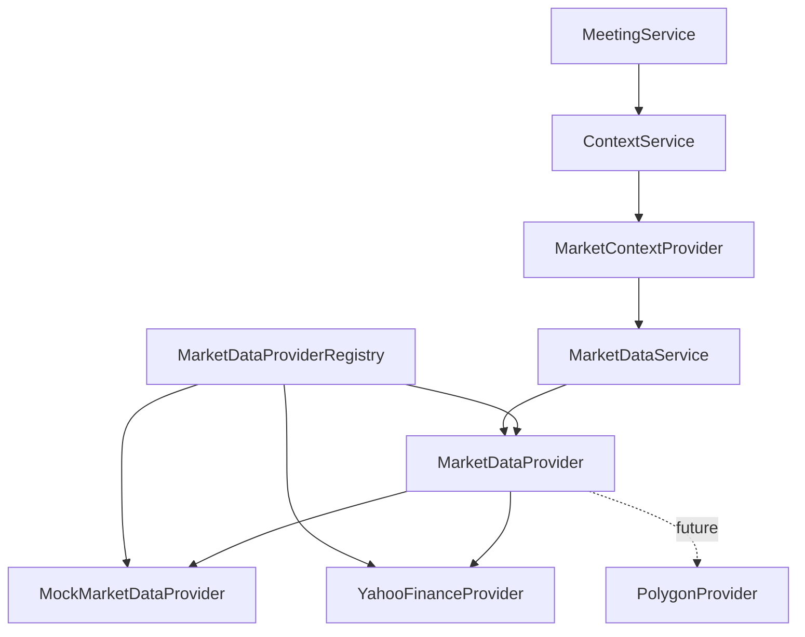

# Market Data Layer Architecture

The Market Data Layer is the provider-agnostic boundary for prices, historical
bars, and market metadata. It gives ParakeetNest one internal language for
market facts before those facts enter the Context Layer and the AI Committee.

The layer exists so the committee never talks to Yahoo Finance, Polygon,
Robinhood, AlphaVantage, or any other market provider directly. Committee agents
reason over prepared `MeetingContext`; they do not know which vendor supplied a
price, how a vendor names a symbol, which API failed, or whether the data came
from deterministic fixtures during tests.

## Architecture



```text
Context Layer
  -> MarketDataService
  -> MarketDataProviderRegistry
  -> MarketDataProvider
  -> MockMarketDataProvider
  -> YahooFinanceProvider
  -> PolygonProvider (future)
```

### Context Layer

The Context Layer asks for market facts when building `MeetingContext` for a
committee meeting. Today, `MarketContextProvider` adapts
`MarketDataSnapshot` objects into `MarketSnapshot` and `MarketDataPoint`
context sections.

### MarketDataService

`MarketDataService` is the single application entry point for market data
requests. It validates provider support for a `Symbol` before delegating
snapshot or price history requests to the configured provider.

### MarketDataProvider

`MarketDataProvider` is the provider contract. A provider must answer whether it
supports a symbol, return a current `MarketDataSnapshot`, and return historical
`PriceBar` data for a `MarketDataRange`.

### MarketDataProviderRegistry

`MarketDataProviderRegistry` centralizes provider selection. Application
bootstrap registers available providers, resolves the provider named by
configuration, and passes the resulting `MarketDataProvider` into
`MarketDataService`.

The default configuration is:

```yaml
market_data:
  provider: mock
```

To use the Yahoo provider:

```yaml
market_data:
  provider: yahoo
```

Unknown provider IDs raise a configuration error that includes the configured
name and the available provider IDs. Provider selection must stay in the
registry; application code should not scatter provider-specific conditionals.

### MockMarketDataProvider

`MockMarketDataProvider` is the default concrete provider. It uses deterministic
in-memory fixtures for supported symbols such as AMD, AAPL, MSFT, NVDA, SPY,
and POET. It makes tests repeatable and allows the committee pipeline to run
without network calls or API keys.

### YahooFinanceProvider

`YahooFinanceProvider` is the optional live-data adapter selected with
`market_data.provider: yahoo`. It remains isolated behind the
`MarketDataProvider` contract, and its third-party SDK import stays inside the
provider module so mock-only runs do not depend on live provider behavior.

### Future Providers

Future providers will implement the same `MarketDataProvider` interface:

- `PolygonProvider` for richer market data APIs and higher quality historical
  data.
- `RobinhoodProvider` for account-adjacent market data only where appropriate;
  ParakeetNest must not implement automatic trading.
- `AlphaVantageProvider` for an additional quote/history fallback source.

## Domain Models

The domain models live in `src/parakeetnest/market_data/models.py`. They are
provider-neutral and immutable where appropriate, so data can move through the
system without leaking vendor response shapes.

- `Symbol`: normalized market identifier. It uppercases and trims ticker,
  exchange, and market values for stable comparisons.
- `AssetType`: provider-independent asset class enum with `stock`, `etf`,
  `index`, `crypto`, and `unknown`.
- `MarketDataSnapshot`: point-in-time quote data for one symbol, including
  price, currency, timestamp, optional previous close, OHLC fields, and volume.
- `PriceBar`: OHLCV data for one historical interval.
- `MarketDataRange`: provider-neutral history request, using either period and
  interval values, explicit start and end times, or both.

## Error Handling & Resilience

Market data failures use a provider-independent exception hierarchy from
`src/parakeetnest/market_data/errors.py`:

- `MarketDataError`: base class for all market data domain failures.
- `ProviderUnavailableError`: transient or operational provider failure, such
  as timeouts, temporary network failures, and provider outages.
- `InvalidSymbolError`: invalid, unsupported, missing, or delisted symbol.
- `RateLimitError`: provider rate limit or quota block.
- `MalformedMarketDataError`: empty, missing, or malformed provider payloads.

Providers are responsible for translating third-party exceptions before they
cross the provider boundary. `yfinance`, pandas, requests, socket, HTTP, and
other provider-specific exceptions must not reach `MarketDataService`, the
Context Layer, or the AI Committee. Callers should catch `MarketDataError`
subclasses rather than vendor SDK exceptions.

The Yahoo provider owns its retry behavior. It retries only transient provider
failures:

- timeout;
- temporary network failure;
- retryable provider unavailable failure.

It does not retry invalid symbols, empty responses, malformed responses, rate
limits, or non-retryable unexpected provider failures. Empty and malformed data
are data quality failures, not transport failures, so retrying the same request
inside one provider call would hide the real issue.

Provider failures are logged with the provider name, operation, symbol or
symbols, and root cause. Expected user errors such as invalid symbols are logged
without stack traces.

## Provider Abstraction

Providers implement a common interface because the rest of ParakeetNest should
depend on market data capabilities, not vendor SDKs or HTTP response formats.
That keeps vendor-specific authentication, rate limits, symbols, timestamps,
and failures at the edge.

The current interface is intentionally small:

- `supports(symbol)`: checks whether the provider can serve the symbol.
- `get_snapshot(symbol)`: returns current point-in-time market data.
- `get_price_history(symbol, range)`: returns historical price bars.

This supports dependency inversion: the service and context layers depend on an
interface, while vendor integrations depend on that interface by implementing
it.

## Service Layer

`MarketDataService` exists so application code does not call providers
directly. Today it owns the support check and delegates to one configured
provider. Provider construction and selection live in
`MarketDataProviderRegistry`, keeping the service public API stable while
provider behavior grows.

Future epics should place cross-provider operational behavior here:

- caching of recent snapshots and historical bars;
- provider fallback when the primary source cannot serve a symbol or request;
- metrics for latency, failures, freshness, and source coverage.

Those features belong in the service because they are orchestration concerns,
not vendor adapter concerns and not committee reasoning concerns.

## Context Layer Integration



`MeetingService` creates a `ContextRequest` from the question and ticker.
`ContextService` runs supported context providers in configured order.
`MarketContextProvider` turns requested ticker strings into normalized
`Symbol` objects and asks `MarketDataService` for snapshots.

That path keeps the AI Committee independent of data sources:

- committee agents receive rendered context, not provider clients;
- market data is normalized before it enters `MeetingContext`;
- provider metadata becomes context metadata and data quality notes;
- replacing the provider does not require changing committee prompts, agents,
  or meeting orchestration.

## Future Roadmap

### Epic 5: Yahoo Finance Provider

Add the first real market data provider behind the existing provider interface.
The provider should map Yahoo Finance responses into `MarketDataSnapshot` and
`PriceBar` without changing committee or context code.

### Epic 6: News Layer

Add a provider-agnostic news layer that can feed the Context Layer with
company, market, and catalyst news while preserving source attribution.

### Epic 7: Portfolio Layer

Add portfolio context so committee recommendations can reason about current
positions, exposure, concentration, and unrealized gains or losses. This must
remain research-only and must not create automatic trading behavior.

### Epic 8: Macro Layer

Add macroeconomic context such as rates, inflation, liquidity, employment, and
sector-level indicators through provider-neutral models.

## Design Principles

- Dependency Inversion: callers depend on `MarketDataProvider`, not concrete
  vendor implementations.
- Single Responsibility: providers adapt external data; `MarketDataService`
  orchestrates provider access; the Context Layer adapts market data into
  meeting context.
- Provider Agnostic: internal models use ParakeetNest types rather than vendor
  payloads.
- Testability: deterministic test doubles can be injected through the provider
  interface.
- Deterministic Mock Providers: mock data is embedded, stable, and network-free
  so tests and committee runs are reproducible.
- No Automatic Trading: provider integrations may supply research data, but
  they must not execute trades.
- No Hard-Coded API Keys: future providers must read credentials from
  configuration or the environment.
