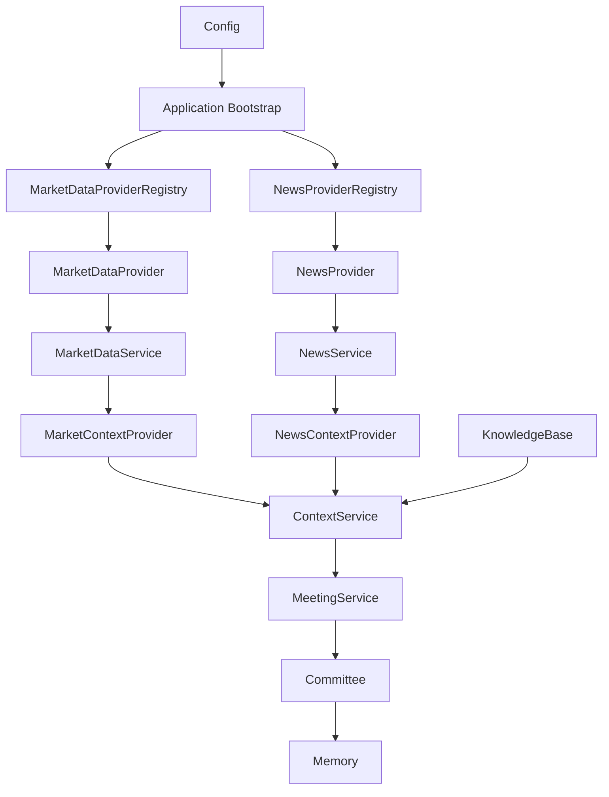

# Architecture Milestone Review v0.6

Date: 2026-06-29

Status: Completed review after Epic 6.6.

Scope: Architecture and documentation review only. No production code changes
are included in this milestone review.

## Executive Summary

ParakeetNest v0.6 completes the News Layer and generalizes the provider-backed
architecture that began with market data. The system now has two concrete
examples of the same data source pattern: Market Data and News. Both use
provider-neutral models, provider protocols, registries, services, context
providers, deterministic mock providers, and optional Yahoo Finance adapters.

The most important v0.6 outcome is architectural consistency. Future sources no
longer need to invent their own integration style. SEC filings, macro data,
portfolio data, and calendar data should follow the unified Data Source Layer
pattern documented in `docs/architecture/data-source-layer.md`.

Overall architecture score: **8.7 / 10**

Readiness for Epic 7: **Ready**

## Completed Layers

- Foundation: configuration, logging, runtime, and common exceptions.
- SQLite v1 persistence: schema, repositories, connection helpers, and
  migrations.
- Memory: knowledge base, thesis tracking, and discussion history.
- Committee: Xixi, Dongdong, Yoyo, Chairman, and Investment Secretary.
- LLM abstraction: mock provider, schemas, parser, prompts, and provider
  boundary.
- Context Layer: provider registry, context service, rendering, and merge rules.
- Market Data Layer: provider protocol, registry, service, mock provider, Yahoo
  Finance provider, and market context adapter.
- News Layer: provider protocol, registry, service, mock provider, Yahoo Finance
  news provider, and news context adapter.

## Current Architecture

```text
Application bootstrap
  -> AppConfig
  -> data source registries
  -> selected providers
  -> data services
  -> context providers
  -> ContextService
  -> MeetingService
  -> committee runtime
  -> memory and decision records
```

The committee still receives prepared context rather than external provider
clients. This preserves the mission rule that the committee remembers before it
reasons.

## Dependency Graph



Dependency direction remains:

```text
provider adapters -> provider protocols -> services -> context -> meetings -> committee
```

## Strengths

- The provider, registry, service, and context provider pattern is now proven
  across two data families.
- Provider SDK imports remain isolated from committee reasoning.
- Mock providers keep local development and tests deterministic.
- Context assembly remains source-agnostic and merge-focused.
- Source attribution is explicit in the News Layer.
- Application bootstrap centralizes concrete provider selection.
- The roadmap now has a clear data-source sequence for filings, macro,
  portfolio, and calendar work.

## Known Technical Debt

- Market data and news reuse some error vocabulary. Future layers may need a
  shared data-source error base rather than borrowing market data names.
- Context provider errors remain string-based in `ContextProviderResult`.
- Model names across `domain`, `context`, `market_data`, and `news` require
  continued discipline.
- Provider-specific configuration is still shallow and not yet generalized
  across all data source families.
- The committee orchestration path still has direct persistence knowledge in
  places where a future protocol could improve replay and alternate storage.
- Service package naming still mixes application workflow services and older
  collection-style services.

## Future Evolution

Epic 7 should add the SEC Filing Layer using the unified Data Source Layer
architecture. It should introduce filing provider-neutral models, source URLs,
filing dates, accession identifiers, excerpts or metadata, a deterministic mock
provider, a registry, a service, and a context adapter.

Epic 8 should add the Macro Layer with provider-neutral indicator, release,
series, and observation models. It should keep economic data fetching out of
committee and context assembly internals.

Epic 9 should add the Portfolio Layer with read-only account, position,
allocation, and exposure context. It must not introduce trading execution.

Epic 10 should add the Calendar Layer for earnings, dividends, filings,
economic releases, and committee scheduling context.

Across all future layers:

- providers fetch and normalize facts only;
- services expose provider-neutral operations;
- context providers adapt service results into `MeetingContext`;
- live providers remain opt-in;
- tests remain network-free by default;
- recommendations continue to require action, confidence, horizon, evidence,
  risks, and catalysts;
- automatic trading remains out of scope.
