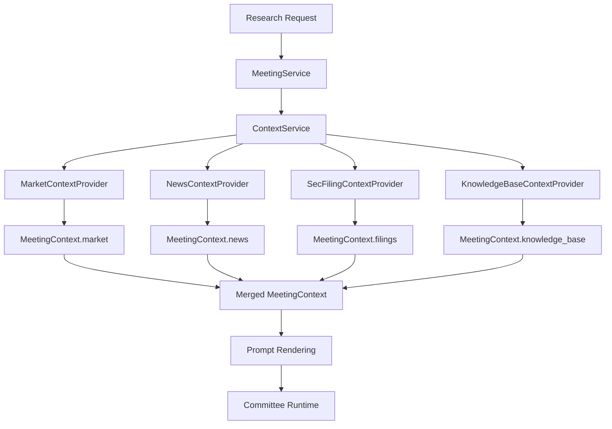
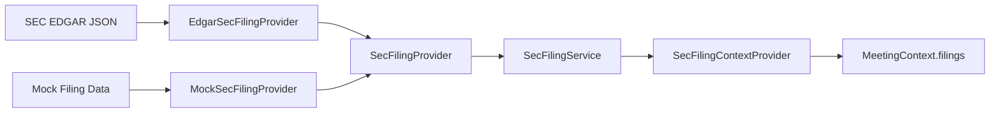

# Architecture Milestone Review v0.7

Date: 2026-06-30

Status: Completed review after Epic 7.6.

Scope: Architecture and documentation review only. No production code changes
are included in this milestone review.

## Executive Summary

ParakeetNest v0.7 completes the SEC Filing Layer and proves the unified Data
Source Layer pattern across three data families: Market Data, News, and SEC
filings. The platform can now assemble market facts, source-attributed news,
and regulatory filing metadata before committee reasoning.

The most important v0.7 outcome is evidence depth. Xixi, Dongdong, Yoyo, and
the Chairman still receive prepared context rather than provider clients, but
that context can now include company filings with accession numbers, filing
dates, form types, and SEC URLs.

Overall architecture score: **8.9 / 10**

Readiness for Epic 8: **Ready**

## Platform

### Foundation

Configuration, logging, common exceptions, app bootstrap, and test app creation
remain stable. `AppConfig` now includes nested SEC filing configuration beside
market data and news configuration.

### Database

SQLite remains the v1 persistence target. The SEC Filing Layer is currently
read-through context data and does not add filing persistence tables. This is
appropriate for v0.7 because filing metadata is used as meeting evidence, not
yet as a historical corpus.

### Knowledge Base

The knowledge base remains the memory system. Filing context is assembled before
reasoning, while the Investment Secretary continues to record discussion and
lessons after meetings. This preserves the rule that the committee remembers
before it reasons.

### Committee Engine

The committee role model remains intact:

- Xixi reviews fundamentals.
- Dongdong reviews opportunity.
- Yoyo reviews risk.
- Chairman produces the final decision.
- Investment Secretary maintains memory.

No automatic trading path has been introduced.

### Agent Runtime

The LLM provider boundary and mock runtime remain independent from data source
providers. The runtime consumes rendered context and does not know whether facts
came from mocks, Yahoo, or SEC EDGAR.

### Meeting Service

`MeetingService` continues to orchestrate context assembly before committee
execution. It depends on `ContextService`, not on data provider registries or
concrete provider adapters.

## Context

### Context Layer

The Context Layer now includes filing support through `MeetingContext.filings`,
`FilingSnapshot`, and `FilingItem`. It also has a concrete
`SecFilingContextProvider` registered during bootstrap.

### Context Pipeline

The pipeline remains provider-neutral. Each context provider contributes one
partial section, and `ContextService` handles assembly and merge behavior.

## Data Sources

### Market Data

The Market Data Layer remains the price and quote source family. It has a
provider protocol, mock provider, Yahoo provider, registry, service, and market
context adapter.

### Yahoo Provider

Yahoo Finance remains the optional live provider for market data and news. It is
selected through configuration and tested with injected or mocked responses
rather than live network calls.

### News

The News Layer remains complete from v0.6. It exposes source-attributed
`NewsArticle` values through `NewsService` and maps them into
`MeetingContext.news`.

### SEC Filing

The SEC Filing Layer is complete for metadata retrieval and context integration:

- `SecFiling`, `SecFilingContent`, `SecFilingQuery`, and `FilingType` define
  provider-neutral models.
- `SecFilingProvider` defines the provider contract.
- `MockSecFilingProvider` keeps tests and local development deterministic.
- `EdgarSecFilingProvider` supports official SEC EDGAR metadata endpoints.
- `SecFilingProviderRegistry` resolves `mock` and `sec_edgar`.
- `SecFilingService` exposes filing search and convenience methods.
- `SecFilingContextProvider` maps filings into `MeetingContext.filings`.
- `create_app` wires the service and context provider.

EDGAR selection requires an explicit User-Agent. Full filing content retrieval,
section extraction, and filing persistence remain future work.

## Architecture Quality

### Dependency Inversion

Data source services depend on provider protocols instead of concrete provider
classes. Context providers depend on services, not registries or provider SDKs.
The committee depends on rendered context, not data source packages.

### Provider Pattern

The provider pattern is now proven by Market Data, News, and SEC filings.
Concrete providers normalize external payloads into provider-neutral models
before callers see the data.

### Registry Pattern

Registries remain bootstrap-only lookup mechanisms. They provide stable provider
IDs, duplicate protection, deterministic resolution, and early configuration
failure for unknown IDs.

### Service Pattern

Each data source family has a service boundary. Services are intentionally small
today and provide a future home for fallback, caching, deduplication, freshness
policy, and ranking.

### Context Provider Pattern

Market, news, and SEC filing integrations all enter the committee through
context providers. This keeps `ContextService` focused on assembly and prevents
source-specific fetching logic from spreading across the pipeline.

### Bootstrap

Application bootstrap is the only place where concrete data providers are
selected. SEC EDGAR configuration fails early when selected without a User-Agent,
while the mock provider remains the default.

### Test Coverage

Coverage is strongest around boundary behavior:

- provider-neutral models;
- provider protocols;
- registries;
- services;
- context providers;
- bootstrap wiring;
- EDGAR response mapping and error handling.

Tests remain network-free by default.

## Remaining Risks

- Full filing content is not implemented, so committee evidence is limited to
  metadata and URLs.
- Filing metadata is not cached or persisted, so repeated live EDGAR requests
  would need operational guardrails before production use.
- SEC rate limits and fair-access behavior are respected through User-Agent
  configuration, but there is not yet a service-level throttle.
- Context provider errors still flow through generic warning/error strings.
- Data source error types are not yet unified across market data, news, and SEC
  filings.

## Current Technical Debt

- Market data and news still share some market-data-specific error vocabulary.
- SEC filings use their own error base; a shared data-source error taxonomy may
  be useful after Macro and Portfolio layers land.
- Filing context summaries are title-level only.
- Provider-specific configuration is still shallow and manually wired per data
  family.
- The database does not yet have durable storage for provider observations,
  filing metadata, or context snapshots.
- Service package naming still mixes application workflow services and older
  collection-style services.

## Recommended Next Epics

Epic 8 should add the Financial Statement Layer using the same provider,
registry, service, context provider, and bootstrap pattern. It should introduce
provider-neutral income statement, balance sheet, cash flow, period, metric, and
source models so Xixi can compare reported fundamentals against market, news,
and filing context.

Epic 9 should add the Economic Data / Macro Layer. It should introduce
provider-neutral indicator, series, release, and observation models while
keeping economic data fetching out of committee and context assembly internals.

Epic 10 should be selected during planning between the Insider Trading Layer and
the Calendar Layer. Insider trading would add provider-neutral ownership and
transaction context; Calendar would add earnings, dividends, SEC filing events,
economic releases, and committee scheduling context.

Cross-cutting follow-up work should include a shared data-source error taxonomy,
context provider error objects, optional source caching, and filing content
extraction with citations.
