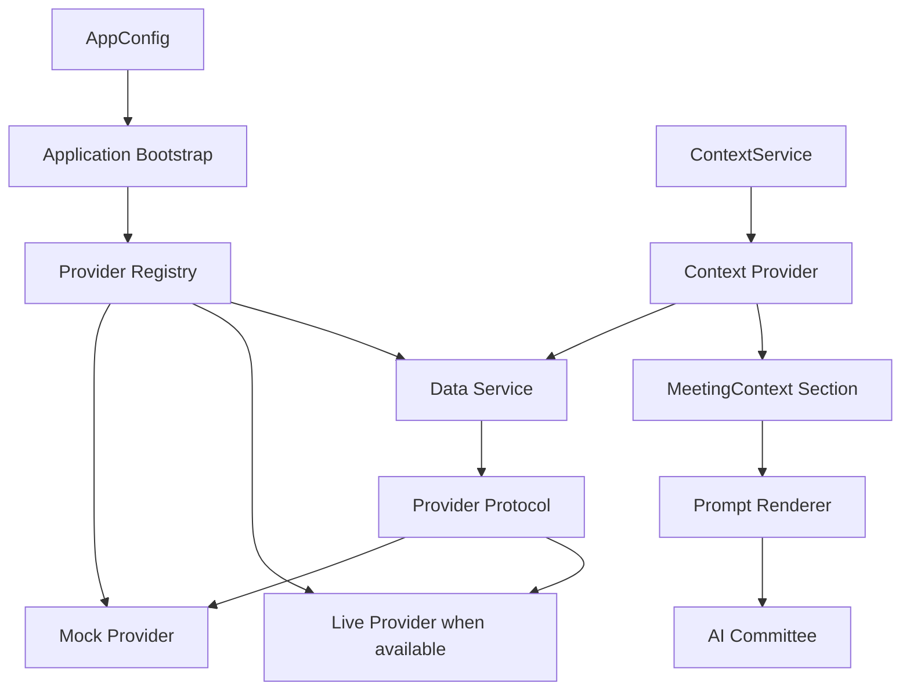
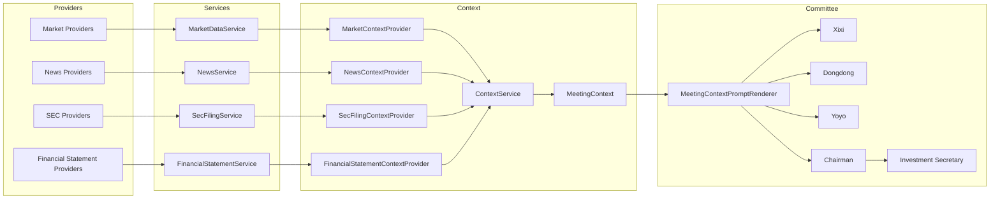
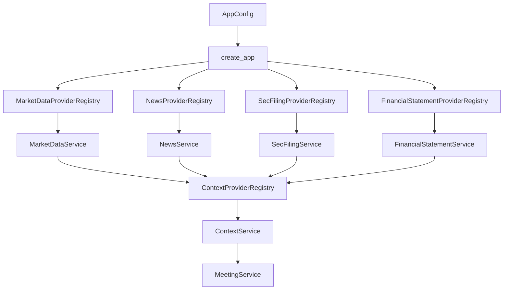
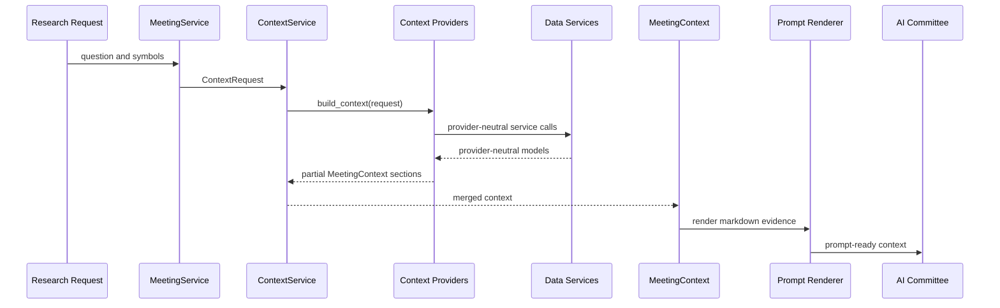

# Architecture Milestone Review v0.8

Date: 2026-06-30

Status: Completed review after Epic 8.7.

Scope: Architecture and documentation review only. No production code changes
are included in this milestone review.

# Overview

ParakeetNest v0.8 completes the Financial Statement Layer and extends the
unified Data Source Layer pattern across four evidence families: Market Data,
News, SEC filings, and Financial Statements.

The platform can now assemble market facts, source-attributed news, regulatory
filing metadata, and normalized reported fundamentals before committee
reasoning. This materially strengthens Xixi's fundamental analysis path while
keeping provider details outside the AI committee.

Completed in v0.8:

- provider-neutral financial statement models;
- `FinancialStatementProvider` interface;
- deterministic `MockFinancialStatementProvider`;
- `FinancialStatementProviderRegistry`;
- `FinancialStatementService`;
- `FinancialStatementContextProvider`;
- prompt rendering for `MeetingContext.financials`;
- application bootstrap wiring;
- tests for models, provider behavior, registry behavior, service behavior,
  context integration, rendering, and app wiring;
- Financial Statement Layer documentation.

Overall architecture score: **9.0 / 10**

Readiness for Epic 9: **Ready**

# Data Source Layer

The Data Source Layer now has a repeated pattern:

## Market Data

Market Data remains the price and quote source family. It includes
provider-neutral market models, a provider protocol, deterministic mock data,
Yahoo Finance integration, provider registry, service boundary, and
`MarketContextProvider`.

Market data reaches the committee through `MeetingContext.market`.

## News

News remains the source-attributed article family. It includes provider-neutral
article and query models, a provider protocol, deterministic mock data, Yahoo
Finance news integration, provider registry, service boundary, and
`NewsContextProvider`.

News reaches the committee through `MeetingContext.news`.

## SEC

SEC filings remain the regulatory filing metadata family. The layer includes
provider-neutral filing models, a provider protocol, deterministic mock data,
optional SEC EDGAR metadata integration, registry, service boundary, and
`SecFilingContextProvider`.

SEC filing metadata reaches the committee through `MeetingContext.filings`.
Full filing content retrieval, section extraction, citation models, and filing
persistence remain future work.

## Financial Statements

Financial Statements are now complete for v0.8. The layer includes:

- `FinancialStatementPeriod`;
- `IncomeStatement`;
- `BalanceSheet`;
- `CashFlowStatement`;
- `FinancialStatementBundle`;
- `FinancialStatementRequest`;
- `FinancialStatementProvider`;
- `MockFinancialStatementProvider`;
- `FinancialStatementProviderRegistry`;
- `FinancialStatementService`;
- `FinancialStatementContextProvider`.

Financial statement context reaches the committee through
`MeetingContext.financials`. For each requested symbol, the context provider
requests one annual, one quarterly, and one trailing-twelve-month bundle, then
maps statement values into prompt-ready `FinancialStatementItem` objects.

# Architecture Evolution

The provider pattern began as a way to isolate Market Data from concrete source
adapters. It has since evolved into the standard shape for all external facts.

Evolution by milestone:

- v0.4 and v0.5 established deterministic data services, source attribution,
  data quality checks, and provider-neutral market access.
- v0.6 applied the same idea to news, adding article-specific models while
  keeping Yahoo payloads behind an adapter.
- v0.7 proved the pattern works for regulatory filings, where provider errors,
  SEC identity requirements, and source URLs matter.
- v0.8 applies the pattern to fundamentals, where normalized domain models are
  more complex and the context output must remain compact.

The key architectural improvement is consistency. Each new data family now has
an obvious home for provider adapters, request models, errors, registry lookup,
service behavior, context adaptation, and tests.

# Current Architecture

Bootstrap is the only place that selects concrete providers:

# Context Pipeline

The context pipeline makes "the committee remembers before it reasons" concrete.

Current context sections:

- `market`: prices, change, volume, valuation hints, and quote metadata.
- `news`: source-attributed company and market articles.
- `filings`: recent regulatory filing metadata and URLs.
- `financials`: normalized annual, quarterly, and trailing-twelve-month
  statement values.
- `portfolio`: deterministic placeholder portfolio context.
- `macro`: deterministic placeholder macro context.
- `knowledge_base`: remembered thesis, discussions, notes, and lessons.

The committee receives rendered context. It does not fetch data, select
providers, parse payloads, or mutate persistence during context assembly.

# Remaining Data Sources

## Portfolio

Portfolio context exists as a mock context provider, but there is no
provider-backed Portfolio Layer yet. A future layer should model accounts,
positions, lots, cash, exposure, realized and unrealized profit/loss, and source
attribution.

Automatic trading remains out of scope.

## Macro

Macro context exists as a mock context provider, but there is no provider-backed
Macro Layer yet. Epic 9 should add provider-neutral economic indicators,
series, releases, observations, and freshness metadata.

## Calendar

Calendar context is not yet implemented as a provider-backed source. It should
eventually include earnings dates, ex-dividend dates, SEC filing deadlines,
economic releases, corporate events, and internal committee scheduling context.

## Knowledge Base

The knowledge base is implemented as the memory system, but it is not yet a
provider-backed retrieval layer with ranking, citations, or semantic search.
Future work should preserve deterministic memory-first assembly while improving
retrieval quality.

## Valuation

Valuation is not yet a dedicated layer. Financial statement facts now exist, but
derived multiples, discounted cash flow assumptions, scenario analysis, margin
trends, and quality metrics should live in a future analysis or valuation layer
rather than inside the Financial Statement Layer.

# Technical Debt

Current limitations:

- Financial statements are mock-only; no live fundamentals provider exists yet.
- Financial statement values are not persisted to SQLite.
- There is no point-in-time restatement handling or amended filing policy.
- Financial statements do not include citations back to filing URLs or vendor
  records.
- Ratios, growth rates, margins, and valuation metrics are not calculated.
- Provider-specific configuration is still manually wired per data family.
- Market data, news, SEC filings, and financial statements do not share one
  data-source error taxonomy.
- Context provider errors are still rendered through generic warning strings.
- Service-level caching, fallback, throttling, metrics, and provider health
  checks remain future work.
- The repository still contains older collection-service concepts alongside the
  newer provider-backed Data Source Layer.

# Next Milestone

Epic 9 should add the Economic Data / Macro Layer.

Recommended Epic 9 scope:

- provider-neutral macro indicator, series, release, and observation models;
- `MacroProvider` interface;
- deterministic mock macro provider;
- optional live provider only if source requirements are clear;
- macro provider registry;
- macro service boundary;
- `MacroContextProvider` backed by the macro service;
- prompt rendering for macro observations and release context;
- network-free tests by default.

Epic 9 should keep the same rule as previous data families: macro providers
normalize external payloads at the edge, context assembly remains
provider-neutral, and the committee reasons only after memory and evidence have
been assembled.
