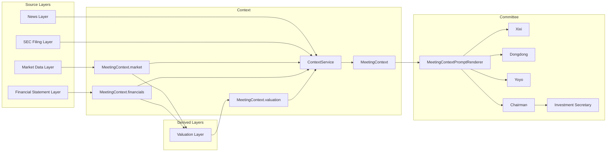
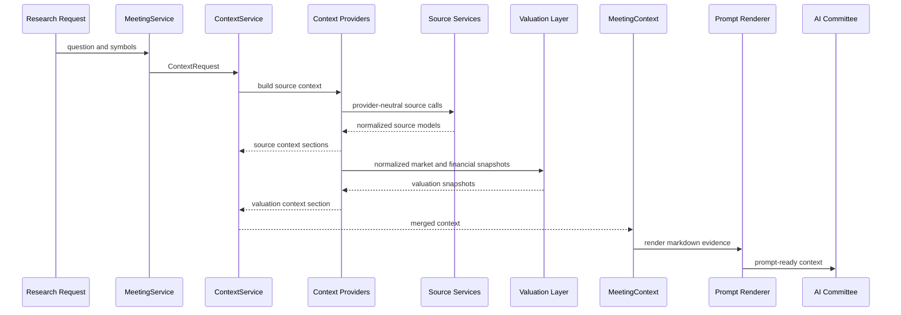

# Architecture Milestone Review v0.9

Date: 2026-06-30

Status: Completed review after Epic 9.7.

Scope: Architecture and documentation review only. No production code changes
are included in this milestone review.

## Executive Summary

ParakeetNest v0.9 completes the first Valuation Layer. The platform now has a
provider-neutral path for turning normalized market and financial statement
context into valuation snapshots before committee reasoning.

The most important v0.9 outcome is separation of derived valuation evidence
from raw data acquisition. Market Data and Financial Statements remain the
source layers. Valuation is a calculation layer that consumes their normalized
context and produces ratios, margins, confidence, source attribution, and
calculation notes.

Completed in v0.9:

- `ValuationMetric`, `ValuationMethod`, and `ValuationConfidence`;
- `ValuationInput` and `ValuationSnapshot`;
- `ValuationCalculator`;
- `ValuationService`;
- `ValuationInputBuilder`;
- `ValuationContextProvider`;
- `ValuationContextItem`, `ValuationContextSnapshot`, and
  `MeetingContext.valuation`;
- prompt rendering for valuation context;
- network-free tests for valuation models, calculator behavior, service
  behavior, input normalization, context provider behavior, context models, and
  rendering;
- Valuation Layer documentation.

Overall architecture score: **9.1 / 10**

ParakeetNest v0.9 status: **Complete**

## Current Architecture

The architecture now distinguishes two kinds of evidence:

- source evidence: market data, news, SEC filings, and financial statements;
- derived evidence: valuation snapshots calculated from normalized source
  context.

The committee receives rendered context only. It still does not fetch data,
select providers, parse payloads, or run trading actions.

## Valuation Layer Review

The Valuation Layer is provider-neutral and deterministic. It consists of:

- domain models for valuation inputs, snapshots, metrics, methods, and
  confidence;
- an input builder that extracts market capitalization, enterprise value,
  revenue, profit, equity, EBITDA, and free cash flow from normalized context;
- a calculator that derives basic multiples, margins, and free-cash-flow yield;
- a service boundary that owns calculator delegation;
- a context provider that maps service outputs into `MeetingContext.valuation`;
- renderer support for committee-readable valuation context.

Current calculated metrics:

- price-to-earnings;
- price-to-sales;
- price-to-book;
- enterprise-value-to-sales;
- enterprise-value-to-EBITDA;
- gross margin;
- operating margin;
- net margin;
- free-cash-flow yield.

The calculator handles missing values and zero denominators by returning `None`
for the affected metric and adding calculation notes. This is the right default
for an AI research system because uncertainty should be visible to Xixi,
Dongdong, Yoyo, and the Chairman rather than hidden behind exceptions or
invented numbers.

## Context Pipeline

The context pipeline continues to make "the committee remembers before it
reasons" concrete:

In the current codebase, the valuation context provider is implemented and
tested as a service-backed provider. Application bootstrap does not yet register
it by default because it needs access to previously assembled market and
financial statement snapshots. That integration point should be addressed when
the context pipeline grows first-class support for derived providers.

## Architecture Quality

### Dependency Boundaries

The valuation package does not import concrete providers. It depends on
provider-neutral context and valuation models. This keeps raw vendor payloads
and provider-specific behavior at the data-source edge.

### Service Boundary

`ValuationService` is intentionally small. It gives the application a stable
entry point while leaving room for multiple calculators, scenario engines,
fallback policies, and persistence later.

### Context Boundary

`ValuationContextProvider` converts internal valuation snapshots into context
items. The renderer consumes those context items, not calculator objects. This
preserves a clean boundary between calculation and prompt assembly.

### Testing

The v0.9 valuation tests are network-free and focus on boundary behavior:

- model normalization and enum coercion;
- invalid enum failure;
- missing input handling;
- zero denominator handling;
- service delegation;
- context input extraction;
- source attribution;
- confidence assignment;
- multi-symbol context provider behavior;
- prompt rendering.

## Technical Debt

Current limitations and follow-up risks:

- Valuation context is not registered in application bootstrap by default.
- The context pipeline does not yet have first-class support for derived
  providers that depend on earlier context sections.
- Growth metrics are modeled but not calculated.
- Valuation methods beyond historical multiples are modeled but not implemented.
- There is no peer or industry normalization.
- Valuation snapshots are not persisted to SQLite.
- There is no source citation model linking each ratio to exact source values.
- Freshness and point-in-time policy remain implicit.
- Financial statements are still mock-only by default.
- Data-source error handling remains family-specific.
- Context provider errors are still rendered through generic warning strings.

## Readiness

ParakeetNest v0.9 is complete for the first valuation milestone.

The platform now has:

- memory-first committee workflow;
- SQLite v1 persistence;
- provider-backed market data;
- provider-backed news;
- provider-backed SEC filing metadata;
- provider-backed financial statement context;
- provider-neutral valuation calculations;
- prompt-rendered valuation context;
- network-free tests by default.

Recommended next milestone: add first-class derived-context orchestration so
valuation can be registered in application bootstrap after market and financial
statement context are available. After that, expand valuation methods and add
persistence, citations, and point-in-time policy.

