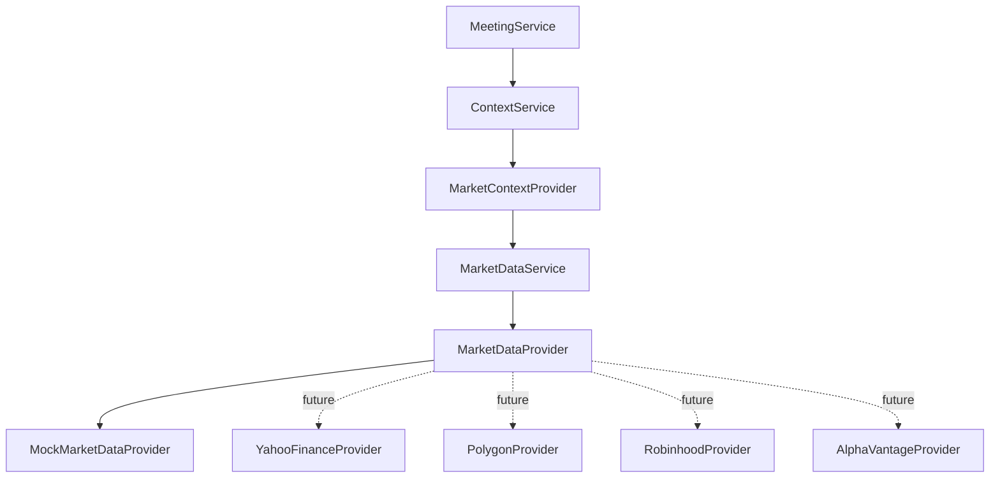

# Epic 004: Market Data Layer

## Goals

Epic 004 introduced a provider-agnostic Market Data Layer for ParakeetNest.

The goal was to give the Context Layer and committee pipeline one stable way to
ask for market prices and historical bars while keeping vendor details outside
committee reasoning. The committee remembers before it reasons, and market data
now enters that memory-first path through typed context instead of direct
provider access.

This epic intentionally did not add automatic trading, hard-code API keys, or
connect to live provider APIs.

## Implemented Components

### Domain Models

Added provider-neutral market data models:

- `Symbol` for normalized ticker, exchange, and market identity.
- `AssetType` for stable asset class values.
- `MarketDataSnapshot` for point-in-time quote data.
- `PriceBar` for OHLCV historical intervals.
- `MarketDataRange` for provider-neutral history requests.
- `MarketDataError` for structured future error reporting.

### Provider Contract

Added `MarketDataProvider`, a small protocol for market data integrations:

- `supports(symbol)`;
- `get_snapshot(symbol)`;
- `get_price_history(symbol, range)`.

The contract lets future providers plug into ParakeetNest without changing the
committee or context services.

### MockMarketDataProvider

Added a deterministic in-memory provider with embedded snapshot and price
history fixtures. The mock provider supports symbols such as AMD, AAPL, MSFT,
NVDA, SPY, and POET.

This provider exists for local development, repeatable tests, and committee
flows that should not call external APIs.

### MarketDataService

Added `MarketDataService` as the single market data entry point. Today it
checks whether the configured provider supports a symbol, then delegates
snapshot and history requests.

Caching, retries, provider fallback, and metrics are intentionally future
service-layer responsibilities.

### Context Layer Integration

Added `MarketContextProvider`, which adapts `MarketDataSnapshot` objects into
the Context Layer's `MarketSnapshot` and `MarketDataPoint` models.

Application wiring now registers `MarketContextProvider` under the
`market_data` context provider ID using `MarketDataService` and
`MockMarketDataProvider`.

## Architecture



```text
MeetingService
  -> ContextService
  -> MarketContextProvider
  -> MarketDataService
  -> MarketDataProvider
  -> MockMarketDataProvider
  -> YahooFinanceProvider (future)
  -> PolygonProvider (future)
```

The committee sits above this path. It receives rendered meeting context from
the Context Layer and never imports or calls market data providers.

## Design Decisions

### Keep Provider Interfaces Small

The first provider contract supports only snapshots and price history. This is
enough for the current context integration and avoids designing around provider
features that are not yet used.

### Put Vendor Differences Behind Domain Models

Provider responses should be converted into `Symbol`, `MarketDataSnapshot`,
`PriceBar`, and related models before they reach the rest of the application.
This prevents vendor payload shapes from leaking into context, prompts, or
committee code.

### Use a Deterministic Mock First

The first concrete provider is deterministic and in-memory. That makes the
layer testable before live data, credentials, network behavior, rate limits, or
vendor-specific quirks are introduced.

### Keep Operational Behavior in the Service

The service currently performs a support check and delegates. Future caching,
retries, fallback, and metrics should live in `MarketDataService` so each
provider can stay focused on adapting one source.

### Keep Committee Reasoning Provider-Independent

The committee depends on `MeetingContext`, not provider clients. Market data
flows through `MarketContextProvider`, so changing providers should not require
changing agent prompts, meeting orchestration, or recommendation models.

## Lessons Learned

- The Context Layer boundary made market integration small: the new provider
  only needed to populate the existing market context section.
- A deterministic provider catches integration mistakes early because tests can
  assert exact symbols, prices, timestamps, and daily change calculations.
- Provider support checks belong close to the service boundary, where unsupported
  symbols can fail before provider fetch methods run.
- Keeping history and snapshot models separate makes the API clearer than a
  single generic market data payload.

## Future Extensions

### Epic 5: Yahoo Finance Provider

Implement `YahooFinanceProvider` behind `MarketDataProvider`. It should map live
Yahoo Finance quote and history responses into ParakeetNest domain models while
keeping credentials and network behavior out of committee code.

### Epic 6: News Layer

Create a provider-agnostic news layer and context provider for company and
market news. News should include source attribution, timestamps, and catalyst
metadata.

### Epic 7: Portfolio Layer

Add portfolio context for positions, exposure, allocation, and risk review.
This layer must remain research-only and must not place trades.

### Epic 8: Macro Layer

Add macro context for rates, inflation, employment, liquidity, and broad market
conditions through provider-neutral models.

### Service Enhancements

Future market data work should add:

- snapshot and history caching;
- transient failure retries;
- primary and fallback provider routing;
- metrics for provider latency, errors, freshness, and coverage;
- richer structured error reporting using `MarketDataError`.

## Completion Checklist

- Market data domain models are provider-neutral.
- Providers implement a common protocol.
- Mock market data is deterministic and network-free.
- `MarketDataService` is the single market data entry point.
- `MarketContextProvider` connects the Market Data Layer to the Context Layer.
- The committee does not access market providers directly.
- Future provider roadmap is documented.
- No automatic trading was introduced.
- No API keys were hard-coded.
