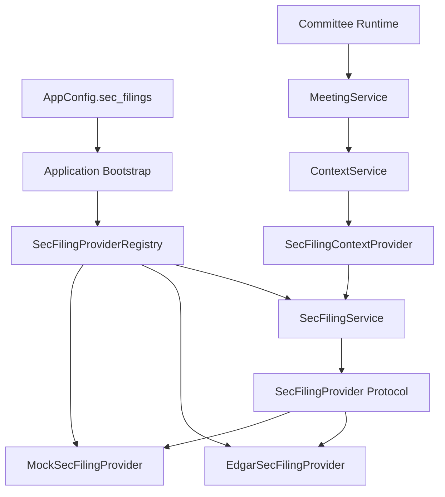
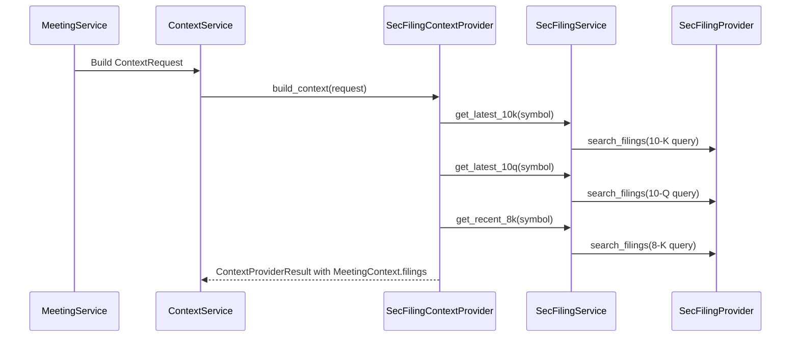

# Epic 007: SEC Filing Layer

## Goals

Add a provider-backed SEC Filing Layer so ParakeetNest can include
source-attributed regulatory filings in meeting context without exposing SEC
payloads, HTTP behavior, or provider details to the committee.

The layer follows the unified Data Source Layer pattern:

- provider-neutral filing domain models;
- a small provider protocol;
- deterministic mock provider for tests and local development;
- optional EDGAR provider selected through configuration;
- provider registry used only during bootstrap;
- service boundary used by callers;
- context provider that writes to `MeetingContext.filings`;
- network-free tests by default.

## Architecture



Dependency direction remains one-way:

```text
concrete provider -> provider protocol -> service -> context provider
  -> ContextService -> MeetingService -> committee
```

The committee receives rendered filing context only. It does not import
`parakeetnest.sec`, SEC HTTP code, or EDGAR response shapes.

## Domain Models

The SEC Filing Layer owns provider-neutral models in `src/parakeetnest/sec`:

- `FilingType`: supported form types, including `10-K`, `10-Q`, `8-K`, `S-1`,
  `DEF 14A`, and `Form 4`.
- `SecFiling`: normalized metadata with accession number, symbol, company name,
  CIK, filing type, filed timestamp, optional report date, title, filing URL,
  document URL, and provider ID.
- `SecFilingContent`: provider-neutral full filing text for one filing.
- `SecFilingQuery`: normalized search request with symbols, filing types, and a
  positive result limit.

Models normalize stable identity fields such as ticker casing and filing type
values at construction time. Provider adapters must return these models before
data crosses the provider boundary.

## Provider Pattern

`SecFilingProvider` is the contract for filing integrations:

- `search_filings(query) -> list[SecFiling]`
- `get_filing_content(accession_number) -> SecFilingContent`

Provider-specific HTTP errors, parsing failures, and payload quirks are mapped
to SEC Filing Layer errors such as `SecFilingHttpError` and
`SecFilingParsingError`. No raw EDGAR response or `urllib` exception should
reach the Context Layer, Meeting Service, or committee runtime.

## Registry

`SecFilingProviderRegistry` maps stable provider IDs to provider instances.

Current provider IDs:

- `mock`: deterministic in-memory provider and default.
- `sec_edgar`: optional live provider backed by official SEC EDGAR JSON
  endpoints.

The registry rejects duplicate IDs, normalizes provider IDs, and raises
`ConfigurationError` for unknown providers. It is a bootstrap boundary only; it
does not implement fallback, ranking, caching, or request-level composition.

## Service

`SecFilingService` is the single application entry point for SEC filing
requests. It depends on `SecFilingProvider`, not concrete providers.

Service operations include:

- `search_filings(query)`;
- `get_filing_content(accession_number)`;
- `get_latest_10k(symbol)`;
- `get_latest_10q(symbol)`;
- `get_recent_8k(symbol, limit=5)`.

The service is intentionally thin in v0.7. Future caching, fallback, freshness
policy, excerpt extraction, and ranking can be added here without changing
committee code.

## Context Provider

`SecFilingContextProvider` adapts SEC filing metadata into
`MeetingContext.filings`.



For each requested symbol, the context provider gathers:

- the latest `10-K`, when available;
- the latest `10-Q`, when available;
- recent `8-K` filings, limited by `recent_8k_limit`.

It maps each `SecFiling` into a `FilingItem` with source, filing type, filed
time, accession number, URL, and title summary.

## EDGAR Provider

`EdgarSecFilingProvider` is registered as `sec_edgar` when a non-blank SEC
EDGAR User-Agent is configured.

It uses official SEC endpoints:

- `https://www.sec.gov/files/company_tickers.json`
- `https://data.sec.gov/submissions/CIK##########.json`
- `https://www.sec.gov/Archives/edgar/data/...`

The provider:

- sends the configured User-Agent to SEC endpoints;
- resolves ticker symbols to CIK values;
- parses company submissions metadata;
- maps SEC forms into `FilingType`;
- creates SEC archive and document URLs;
- returns empty results for unknown symbols;
- maps HTTP and malformed payload failures into provider-neutral errors.

Full filing content retrieval is intentionally not implemented yet. The current
EDGAR path retrieves filing metadata and URLs, which is enough for source
attribution in meeting context.

## Bootstrap

Application bootstrap wires the SEC Filing Layer in `create_app`:

```text
AppConfig.sec_filings
  -> create_sec_filing_provider_registry(...)
  -> configured SecFilingProvider
  -> SecFilingService
  -> SecFilingContextProvider
  -> ContextProviderRegistry
  -> ContextService
```

Defaults are safe for local development:

- `AppConfig.sec_filings.provider` defaults to `mock`.
- Blank EDGAR identity is ignored while `mock` is selected.
- Selecting `sec_edgar` without `sec_filings.sec_edgar_user_agent` raises
  `ConfigurationError` during bootstrap.

This keeps live SEC access explicit and prevents accidental non-compliant EDGAR
requests.

## Testing

Epic 7 includes focused tests for:

- SEC domain model normalization and validation;
- mock provider determinism and query behavior;
- provider protocol conformance;
- registry registration, lookup, duplicate detection, and unknown-provider
  errors;
- service convenience methods for latest `10-K`, latest `10-Q`, and recent
  `8-K`;
- context provider support checks and `MeetingContext.filings` mapping;
- EDGAR ticker lookup, submissions parsing, User-Agent propagation, URL mapping,
  malformed payload handling, and provider-neutral errors;
- application bootstrap defaults and EDGAR configuration validation.

Live network access is not required for the test suite. EDGAR tests inject a
fake byte-returning transport.

## Future Work

- Implement full filing content retrieval and text normalization.
- Add filing section extraction for risk factors, MD&A, business description,
  notes, and legal proceedings.
- Add excerpt and citation models that preserve accession number and source URL.
- Add service-level caching and freshness policy for SEC metadata.
- Add filing change detection across periods.
- Add richer `FilingSnapshot` summaries for prompt rendering.
- Add fallback or alternate filing providers only if a concrete product need
  appears.
- Keep SEC filing evidence read-only; automatic trading remains out of scope.

