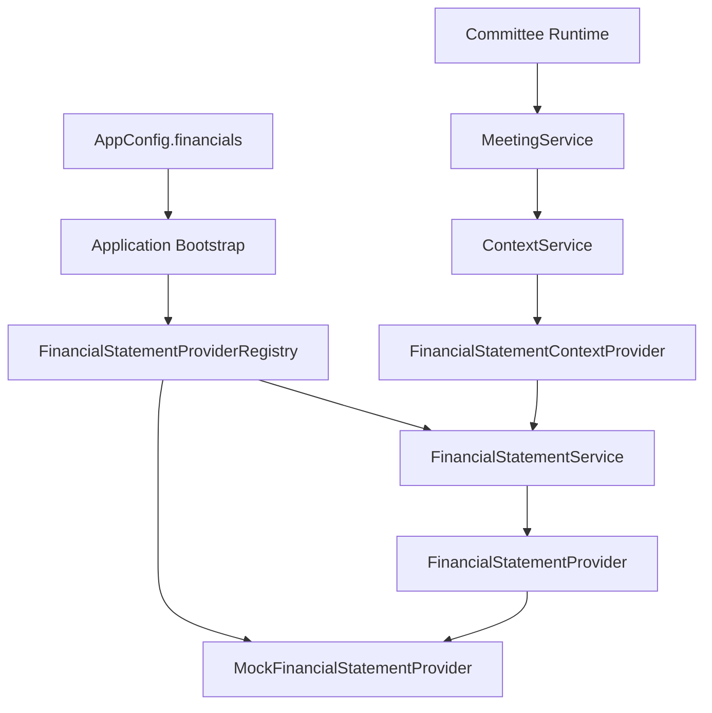
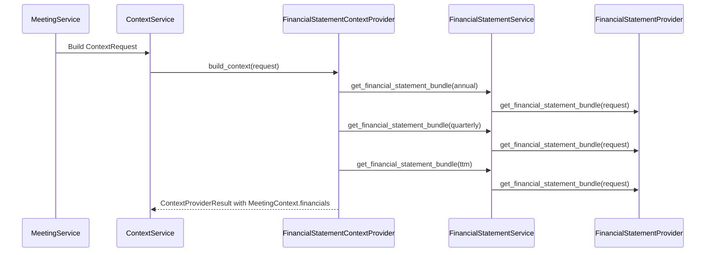

# Epic 008: Financial Statement Layer

## Motivation

Add a provider-backed Financial Statement Layer so ParakeetNest can include
reported fundamentals before Xixi, Dongdong, Yoyo, and the Chairman reason about
an investment question.

The committee should see normalized revenue, income, balance sheet, cash flow,
and period metadata. It should not see provider SDKs, raw vendor payloads, or
provider-specific exceptions.

Epic 8 extends the unified Data Source Layer pattern with:

- provider-neutral financial statement domain models;
- a small provider interface;
- deterministic mock provider for tests and local development;
- provider registry selected during bootstrap;
- service boundary used by callers;
- context provider that writes to `MeetingContext.financials`;
- prompt rendering for annual, quarterly, and trailing-twelve-month facts;
- network-free tests by default.

## Architecture



Dependency direction remains one-way:

```text
concrete provider -> provider interface -> service -> context provider
  -> ContextService -> MeetingService -> committee
```

The committee receives rendered financial statement context only. It does not
import `parakeetnest.financials`, provider registries, or provider adapters.

## Domain Models

The Financial Statement Layer owns provider-neutral models in
`src/parakeetnest/financials`:

- `FinancialPeriodType`: supported period types: annual, quarterly, and
  trailing twelve months.
- `FinancialStatementPeriod`: normalized fiscal period metadata with symbol,
  period type, fiscal year, optional quarter, dates, and currency.
- `IncomeStatement`: common revenue, gross profit, operating income, net income,
  EPS, and share count fields.
- `BalanceSheet`: common asset, liability, equity, cash, investment, debt, and
  working-capital fields.
- `CashFlowStatement`: common operating, investing, financing, capital
  expenditure, free cash flow, depreciation, and stock-based compensation
  fields.
- `FinancialStatementBundle`: grouped statements for one symbol and period.
- `FinancialStatementRequest`: normalized request with symbol, period type, and
  positive result limit.

Models normalize stable identity fields such as ticker casing, period type, and
currency at construction time. Provider adapters must return these models before
data crosses the provider boundary.

## Provider Interface

`FinancialStatementProvider` is the contract for financial statement
integrations:

- `name -> str`
- `get_income_statement(request) -> list[IncomeStatement]`
- `get_balance_sheet(request) -> list[BalanceSheet]`
- `get_cash_flow_statement(request) -> list[CashFlowStatement]`
- `get_financial_statement_bundle(request) -> list[FinancialStatementBundle]`

Provider-specific failures are mapped to `FinancialStatementProviderError`
before they leave the layer. No live provider exception should reach the
Context Layer, Meeting Service, prompt renderer, or committee runtime.

## Mock Provider

`MockFinancialStatementProvider` is the default and currently only registered
provider.

It returns deterministic generated fixtures for:

- annual periods;
- quarterly periods;
- trailing-twelve-month periods;
- income statements;
- balance sheets;
- cash flow statements;
- bundled statements.

The mock provider sets stable source attribution (`mock`) and a deterministic
retrieval timestamp. It varies amounts by symbol and period index so tests can
exercise realistic-looking values without network access.

## Service

`FinancialStatementService` is the single application entry point for financial
statement requests. It accepts either a `FinancialStatementProvider` or a
`FinancialStatementProviderRegistry`, then delegates through the provider
contract.

Service operations include:

- `get_income_statement(request)`;
- `get_balance_sheet(request)`;
- `get_cash_flow_statement(request)`;
- `get_financial_statement_bundle(request)`.

The service is intentionally thin in v0.8. It wraps unexpected provider-specific
exceptions as `FinancialStatementProviderError` while preserving provider-neutral
errors unchanged. Future fallback, caching, restatement handling, point-in-time
policy, normalization, and ratio calculation can be added here without changing
committee code.

## Registry

`FinancialStatementProviderRegistry` maps stable provider names to provider
instances.

Current provider IDs:

- `mock`: deterministic in-memory provider and default.

The registry normalizes provider names, rejects duplicate registrations, can
return a configured default provider, and raises clear errors for unknown
providers. It is a bootstrap boundary only; it does not implement fallback,
ranking, caching, or request-level provider composition.

## Context Integration

`FinancialStatementContextProvider` adapts provider-neutral financial statement
bundles into `MeetingContext.financials`.



For each requested symbol, the context provider asks for one bundle for each
period type:

- annual;
- quarterly;
- trailing twelve months.

It maps each `FinancialStatementBundle` into a `FinancialStatementItem` with
symbol, period metadata, source, revenue, gross profit, operating income, net
income, EPS, cash, total debt, total equity, operating cash flow, free cash
flow, fiscal year, fiscal quarter, and currency.

`MeetingContextPromptRenderer` renders the financial statement section into
committee-readable markdown. The context remains evidence only; it does not
calculate ratios or make recommendations.

## Design Decisions

- Keep the Financial Statement Layer separate from older normalized snapshot
  models so provider-backed fundamentals can evolve without changing SQLite v1
  persistence.
- Use frozen dataclasses for statement models to make provider outputs stable
  and easy to test.
- Normalize symbol and currency casing at model boundaries.
- Treat financial statements as source-attributed context first, not durable
  warehouse data.
- Keep provider selection in application bootstrap.
- Keep the registry out of `ContextService` and committee runtime.
- Fetch annual, quarterly, and trailing-twelve-month bundles for each requested
  symbol to give Xixi a compact fundamentals view.
- Avoid ratio calculation in v0.8. Derived valuation and quality metrics belong
  in later valuation or analysis layers.
- Preserve the project rule that no data source layer can execute trades.

## Future Providers

Future provider adapters can register behind `FinancialStatementProvider` while
preserving the current service and context boundaries. Candidate providers
include:

- SEC company facts or XBRL-derived statements;
- Financial Modeling Prep;
- Alpha Vantage;
- Polygon.io financials;
- Nasdaq Data Link;
- vendor-specific paid fundamentals feeds.

Each adapter should convert source-specific payloads into provider-neutral
period, income statement, balance sheet, cash flow, and bundle models before
returning data.

## Future Improvements

- Add a live provider once product needs and source licensing are explicit.
- Add statement persistence and freshness policy.
- Add point-in-time handling for restatements and amended filings.
- Add source citations that connect statement values back to filing URLs,
  accession numbers, or vendor records.
- Add common financial ratios, margins, growth rates, leverage metrics, and
  free-cash-flow conversion in a separate analysis or valuation layer.
- Add multi-period trend summaries for prompt rendering.
- Add service-level fallback and provider health checks.
- Add shared data-source error taxonomy across market data, news, SEC filings,
  and financial statements.
- Add explicit units and scale handling when live provider payloads are
  introduced.
- Keep financial statement evidence read-only; automatic trading remains out of
  scope.
