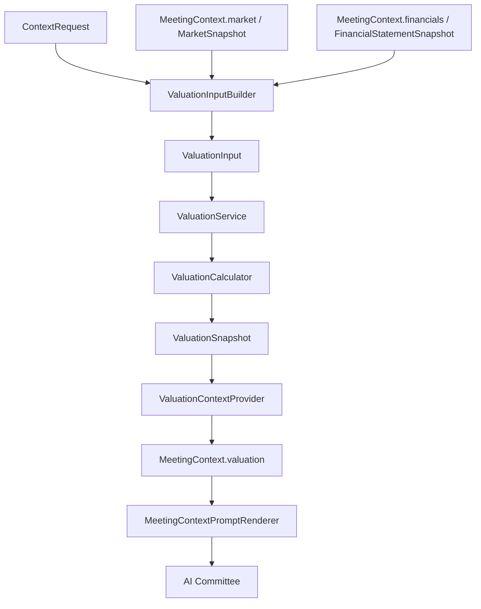
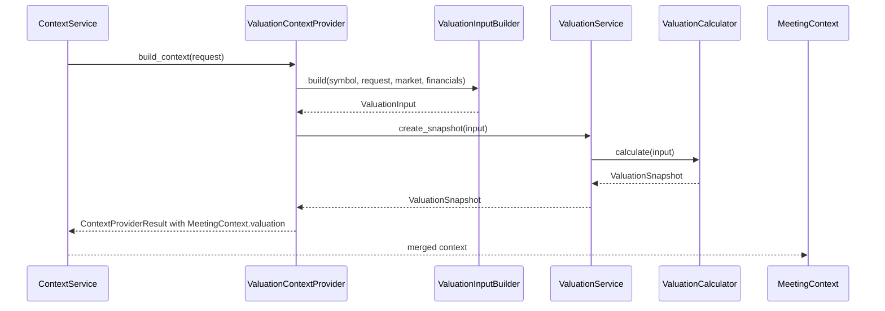

# Epic 009: Valuation Layer

## Purpose

Add a provider-neutral Valuation Layer so ParakeetNest can calculate basic
valuation and quality metrics from already-normalized context before Xixi,
Dongdong, Yoyo, and the Chairman reason about an investment question.

Epic 9 turns market and financial statement evidence into compact valuation
snapshots while preserving the project rule that the committee remembers before
it reasons. The layer does not fetch vendor data directly, does not expose
provider SDKs to the committee, and does not make trading decisions.

The completed v0.9 scope includes:

- provider-neutral valuation domain models;
- a deterministic calculator for common ratios and margins;
- a service boundary for producing valuation snapshots;
- an input builder that derives valuation inputs from normalized context;
- a context provider that writes valuation snapshots to
  `MeetingContext.valuation`;
- prompt rendering for valuation context;
- tests for models, calculator behavior, service delegation, input building,
  context provider behavior, and rendering.

## Architecture



Dependency direction remains one-way:

```text
normalized context -> input builder -> valuation input -> service
  -> calculator -> valuation snapshot -> context provider
  -> ContextService -> prompt renderer -> committee
```

The Valuation Layer depends on normalized context models and its own domain
models. It does not depend on Yahoo Finance, SEC EDGAR, financial statement
providers, market data providers, registries, or raw vendor payloads.

## Data Flow



For each requested symbol, the input builder:

- normalizes the symbol and valuation date;
- selects the matching market data point, when available;
- selects the matching financial statement item, when available;
- extracts market capitalization and enterprise value into metrics;
- extracts revenue, profit, equity, EBITDA, and free cash flow into
  assumptions;
- records source attribution from the contributing context snapshots;
- sets confidence based on whether market data, financial statements, or both
  were present.

The service delegates calculation to the calculator. The context provider maps
the resulting `ValuationSnapshot` into `ValuationContextItem` values for prompt
rendering.

## Domain Models

The Valuation Layer owns provider-neutral models in
`src/parakeetnest/valuation`:

- `ValuationMetric`: stable metric identifiers such as `market_cap`,
  `enterprise_value`, `pe_ratio`, `ps_ratio`, `pb_ratio`, `ev_to_sales`,
  `ev_to_ebitda`, `gross_margin`, `operating_margin`, `net_margin`,
  `revenue_growth`, `eps_growth`, and `free_cash_flow_yield`.
- `ValuationMethod`: supported valuation approaches, including comparable
  companies, discounted cash flow, historical multiples, sum-of-the-parts,
  asset-based, and owner earnings.
- `ValuationConfidence`: confidence labels: low, medium, high, and unknown.
- `ValuationInput`: normalized input for one symbol, method, date, fiscal
  period, metrics, assumptions, sources, calculation notes, and confidence.
- `ValuationSnapshot`: point-in-time output with derived metrics, source
  attribution, calculation notes, fiscal period, date, and confidence.

Models normalize stable fields at construction time. Symbols are uppercased,
metric keys are coerced to `ValuationMetric`, method and confidence values are
coerced to enums, and blank source or note strings are removed.

Context-facing valuation models live in `src/parakeetnest/context/models.py`:

- `ValuationContextItem`;
- `ValuationContextSnapshot`;
- `MeetingContext.valuation`.

Those context models are deliberately separate from the Valuation Layer's
calculation models so prompt rendering can stay stable even if internal
valuation engines grow more sophisticated.

## Calculator

`ValuationCalculator` derives common valuation and quality metrics from a
`ValuationInput`.

Current calculated metrics:

- price-to-earnings: `market_cap / net_income`;
- price-to-sales: `market_cap / revenue`;
- price-to-book: `market_cap / total_equity`;
- enterprise-value-to-sales: `enterprise_value / revenue`;
- enterprise-value-to-EBITDA: `enterprise_value / ebitda`;
- gross margin: `gross_profit / revenue`;
- operating margin: `operating_income / revenue`;
- net margin: `net_income / revenue`;
- free-cash-flow yield: `free_cash_flow / market_cap`.

The calculator is intentionally deterministic and defensive. Missing numerators,
missing denominators, non-numeric values, boolean values, and zero denominators
produce `None` for the affected metric plus a calculation note. They do not
raise and do not produce infinite or misleading values.

## Service

`ValuationService` is the single application entry point for creating valuation
snapshots:

- `create_snapshot(valuation_input) -> ValuationSnapshot`

The service is intentionally thin in v0.9. It owns the calculator dependency and
keeps callers from depending on calculator implementation details. Future
scenario analysis, alternate calculators, fallback engines, caching, and richer
method dispatch can be added behind this service boundary without changing the
committee.

## Input Builder

`ValuationInputBuilder` prepares valuation inputs from normalized context
snapshots. It accepts:

- symbol;
- `ContextRequest`;
- optional `MarketSnapshot`;
- optional `FinancialStatementSnapshot`.

The builder reads context models only. It does not call market data providers,
financial statement providers, SEC providers, Yahoo providers, or registries.
This keeps valuation input construction provider-neutral and makes tests
network-free.

Confidence policy:

- high: both matching market and financial statement context exist;
- medium: only one of market or financial statement context exists;
- low: neither context source exists.

Fiscal period policy:

- quarterly financials render as `FY{year}Q{quarter}`;
- annual or TTM financials render as `FY{year}` when fiscal year is available;
- otherwise the period type is uppercased when present.

## Context Provider

`ValuationContextProvider` adapts service-backed valuation snapshots into
`MeetingContext.valuation`.

For each requested symbol, it:

- builds a `ValuationInput`;
- calls `ValuationService.create_snapshot`;
- maps `ValuationSnapshot` into `ValuationContextItem`;
- returns a `ContextProviderResult` with source metadata
  `{"source": "valuation_service"}`.

The provider supports symbol-specific requests only. Requests without symbols
raise `UnsupportedContextRequestError` if called directly.

`MeetingContextPromptRenderer` renders valuation context as a dedicated
`## Valuation` section with snapshot metadata, metric values, calculation notes,
confidence, and data sources.

## Provider-Neutral Boundary

The Valuation Layer is provider-neutral by design:

- It consumes normalized `MarketSnapshot` and `FinancialStatementSnapshot`
  objects.
- It never imports concrete market data, news, SEC, or financial statement
  providers.
- It never receives raw Yahoo, SEC, or vendor payloads.
- It records source names from context snapshots rather than provider-specific
  clients or response objects.
- It produces `ValuationSnapshot` and `ValuationContextItem` values that can be
  rendered for the committee without exposing calculation internals.

This makes valuation a derived evidence layer rather than a data acquisition
layer.

## Limitations

Current v0.9 limitations:

- The calculator covers only a first set of multiples, margins, and
  free-cash-flow yield.
- Growth metrics are modeled but not yet calculated.
- Discounted cash flow, comparable company analysis, sum-of-the-parts,
  asset-based valuation, and owner earnings methods are modeled but not yet
  implemented as separate engines.
- There is no industry or peer-group normalization.
- There are no source citations back to the exact market observation or
  financial statement bundle used for each number.
- There is no persistence for valuation snapshots in SQLite.
- There is no freshness policy, restatement policy, cache, or historical
  valuation series.
- `ValuationContextProvider` is implemented and tested, but application
  bootstrap does not register it by default yet because the provider currently
  expects market and financial statement snapshots to be injected.
- Valuation context is evidence only. It does not produce recommendations and
  does not execute trades.

## Future Work

- Register valuation context in application bootstrap after context assembly can
  pass prior market and financial statement snapshots into derived providers.
- Add historical growth calculations for revenue and EPS.
- Add richer quality metrics, including return on equity, return on invested
  capital, leverage ratios, interest coverage, cash conversion, and rule-of-40
  style measures where appropriate.
- Add DCF, owner earnings, comparable companies, and scenario-analysis engines
  behind the `ValuationService` boundary.
- Add source citation models that connect every derived metric to market and
  financial statement evidence.
- Persist valuation snapshots in SQLite with clear as-of and source metadata.
- Add freshness and point-in-time policies so valuation context can distinguish
  current market prices from reported financial periods.
- Add industry-aware metric interpretation without hard-coding provider
  behavior.
- Keep valuation read-only and advisory; automatic trading remains out of
  scope.

