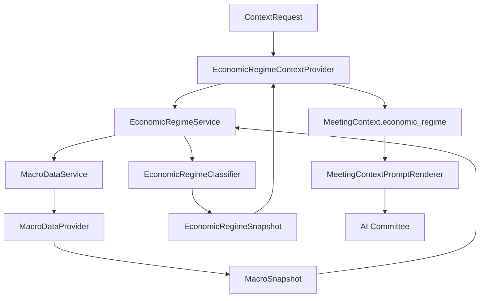
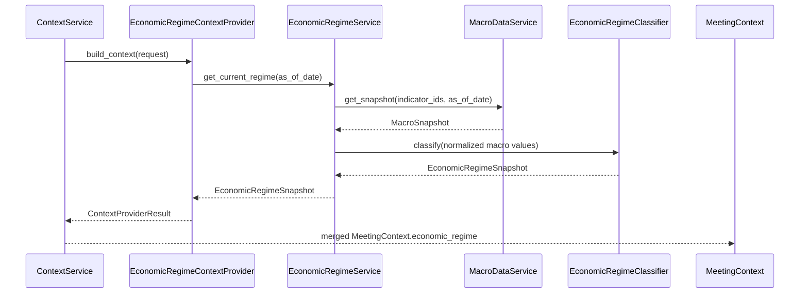

# Epic 011: Economic Regime Layer

## Objective

Add a provider-neutral Economic Regime Layer so ParakeetNest can classify
macroeconomic conditions before Xixi, Dongdong, Yoyo, and the Chairman reason
about an investment question.

Epic 11 turns normalized macro evidence into a compact economic regime snapshot.
The layer is deterministic, rule-based, and service-backed. It does not fetch
vendor data directly, expose raw provider payloads to the committee, call LLMs,
or make trading decisions.

The completed scope includes:

- provider-neutral economic regime domain models;
- a deterministic `EconomicRegimeClassifier`;
- `EconomicRegimeService` over the normalized Macro Layer;
- `EconomicRegimeContextProvider`;
- prompt rendering through the existing Context Layer;
- application bootstrap registration;
- network-free tests for models, classifier rules, service behavior, context
  integration, rendering, and dependency boundaries.

## Completed Stories

### Story 11.1: Economic Regime Domain Models

Completed. Added provider-neutral regime models for regimes, signal families,
confidence levels, evidence indicators, and point-in-time snapshots.

### Story 11.2: Rule-based Economic Regime Classifier

Completed. Added `EconomicRegimeClassifier`, a deterministic classifier that
maps normalized macro indicators into economic regime snapshots.

### Story 11.3: EconomicRegimeService

Completed. Added `EconomicRegimeService` as the public service boundary that
retrieves normalized macro snapshots and delegates classification.

### Story 11.4: EconomicRegimeContextProvider

Completed. Added `EconomicRegimeContextProvider`, prompt-facing context models,
rendering, and application bootstrap registration.

## Architecture



Dependency direction remains one-way:

```text
macro provider -> macro service -> economic regime service
  -> classifier -> regime snapshot -> context provider
  -> ContextService -> prompt renderer -> committee
```

The Economic Regime Layer depends on normalized macro models and its own domain
models. It does not depend on live macro providers, provider registries, vendor
SDKs, raw payloads, memory, decision, or report layers.

## Data Flow



For each supported request, the context provider:

- uses `request.as_of` as the point-in-time date when present;
- asks `EconomicRegimeService` for the current regime;
- maps the snapshot into `EconomicRegimeContextSnapshot`;
- renders classifier indicators into committee-readable evidence lines;
- returns source metadata `{"source": "economic_regime_service"}`.

The prompt renderer renders economic regime context under
`## Economic Regime`. Missing regime context renders explicitly as unavailable.

## Public APIs

The public regime package exports:

- `EconomicRegime`;
- `RegimeSignal`;
- `RegimeConfidence`;
- `RegimeIndicator`;
- `EconomicRegimeSnapshot`;
- `EconomicRegimeClassifier`;
- `EconomicRegimeService`.

`EconomicRegimeClassifier` exposes:

```text
classify(
    real_gdp_growth=None,
    inflation_rate=None,
    unemployment_rate=None,
    yield_curve_spread=None,
    policy_rate=None,
    credit_spread=None,
    as_of_date=None,
) -> EconomicRegimeSnapshot
```

`EconomicRegimeService` exposes:

```text
get_current_regime(as_of_date=None, indicator_map=None)
  -> EconomicRegimeSnapshot

classify_snapshot(macro_snapshot, indicator_map=None)
  -> EconomicRegimeSnapshot
```

`EconomicRegimeContextProvider` exposes the standard context provider surface:

```text
supports(request) -> bool
build_context(request) -> ContextProviderResult
```

It contributes when `ContextRequest.include_macro` is enabled.

## Directory Layout

```text
src/parakeetnest/regime/
  __init__.py
  classifier.py
  context_provider.py
  models.py
  service.py

tests/
  test_regime_models.py
  test_regime_classifier.py
  test_regime_service.py
  test_regime_context_provider.py
```

Related integration points:

```text
src/parakeetnest/app.py
src/parakeetnest/context/models.py
src/parakeetnest/context/rendering.py
src/parakeetnest/context/service.py
tests/test_context_models.py
tests/test_context_rendering.py
```

## Domain Models

The Economic Regime Layer owns provider-neutral models in
`src/parakeetnest/regime`:

- `EconomicRegime`: expansion, slowdown, recession, recovery, stagflation,
  disinflationary growth, overheating, and unknown.
- `RegimeSignal`: growth, inflation, labor, rates, credit, liquidity,
  consumer, fiscal, sentiment, and other.
- `RegimeConfidence`: low, medium, high, and unknown.
- `RegimeIndicator`: one normalized evidence item with signal, name, optional
  value, unit, observed date, and interpretation.
- `EconomicRegimeSnapshot`: point-in-time regime assessment with confidence,
  evidence indicators, summary, source, and as-of date.

Models normalize stable fields at construction time. Enum values are coerced,
strings are stripped, and snapshot indicators are sorted by indicator name.

Context-facing regime models live in `src/parakeetnest/context/models.py`:

- `EconomicRegimeContextSnapshot`;
- `MeetingContext.economic_regime`.

The separation keeps classifier outputs independent from prompt-facing context
shape.

## Classifier

`EconomicRegimeClassifier` is a deterministic rule-based classifier. It accepts
normalized point-in-time macro values for:

- real GDP growth;
- inflation rate;
- unemployment rate;
- yield curve spread;
- policy rate;
- credit spread.

Growth, inflation, and unemployment are required core evidence. Rates and
credit are retained as supporting evidence and can refine rules without
changing the public API.

The current rule set can classify:

- stagflation;
- recession;
- overheating;
- recovery;
- disinflationary growth;
- expansion;
- slowdown;
- unknown.

Missing, boolean, non-numeric, non-finite, and out-of-range inputs are ignored.
If valid evidence is insufficient or does not match a supported rule, the
classifier returns `UNKNOWN` rather than guessing.

Confidence is based on evidence breadth:

- high: at least five valid indicators;
- medium: at least three valid indicators;
- unknown: insufficient valid evidence.

## Service

`EconomicRegimeService` is the public service boundary for regime
classification. It depends on a macro service protocol and a classifier
protocol, not on concrete macro providers.

The default indicator map converts classifier inputs to Macro Layer indicator
IDs:

- `real_gdp_growth` -> `gdp_growth`;
- `inflation_rate` -> `cpi_yoy`;
- `unemployment_rate` -> `unemployment_rate`;
- `yield_curve_spread` -> `yield_curve_spread`;
- `policy_rate` -> `fed_funds_rate`;
- `credit_spread` -> `credit_spread`.

The service can also classify an already-built `MacroSnapshot`. This keeps the
regime layer usable from tests, context providers, and future workflows without
requiring direct provider access.

If the macro service fails, the service returns a neutral unknown snapshot with
source `economic_regime_service`.

## Context Provider

`EconomicRegimeContextProvider` adapts service-backed regime snapshots into
`MeetingContext.economic_regime`.

For each request, it:

- supports requests where `include_macro` is enabled;
- forwards the request as-of date to the service;
- records context metadata source `economic_regime`;
- maps regime, confidence, observed date, summary, and source;
- renders indicators into compact evidence strings.

`MeetingContextPromptRenderer` renders the context as:

- snapshot source and fetch time;
- current regime;
- confidence;
- observed date;
- summary;
- source;
- supporting indicators.

The committee receives rendered economic regime context only. It does not
import the classifier, query the Macro Layer, parse macro provider payloads, or
decide rule thresholds inside the prompt.

## Testing Coverage

Epic 11 keeps the test suite network-free by default.

Test coverage includes:

- regime enum values and provider-neutral signal families;
- model normalization and invalid enum rejection;
- package exports;
- classifier rules for expansion, slowdown, recession, recovery, stagflation,
  disinflationary growth, overheating, and unknown;
- classifier handling for missing, invalid, and out-of-range evidence;
- service extraction from normalized macro snapshots;
- custom indicator maps and classifier injection;
- neutral unknown snapshots when macro retrieval fails;
- provider independence checks for the service and context provider;
- context provider formatting, metadata, support checks, and graceful unknown
  regime handling;
- application bootstrap registration;
- prompt rendering for economic regime context.

## Design Decisions

Economic regime is an investment intelligence layer, not a data acquisition
layer. It consumes normalized macro snapshots and produces derived context.

The classifier is deterministic before committee reasoning. This makes regime
rules reviewable, testable, and repeatable without LLM calls.

The service owns orchestration. It maps macro indicators into classifier inputs,
delegates classification, and provides a future home for caching, freshness,
fallback, persistence, and alternate classifiers.

The context provider renders a committee-facing snapshot rather than exposing
raw macro series. The AI Committee debates implications; it does not parse
provider data or own classification mechanics.

Unknown is an explicit valid state. Missing or invalid macro evidence should
produce neutral context instead of invented certainty.

The layer remains research-only. It can inform recommendations, but it does not
execute trades or produce automatic trading instructions.

## Future Extensions

- Add live macro providers behind the existing Macro Layer without changing
  regime service or committee workflows.
- Persist economic regime snapshots in SQLite with as-of dates, source
  metadata, and evidence indicators.
- Add freshness policy so regime context can identify stale macro evidence.
- Add regional regime support for non-U.S. macro snapshots.
- Add richer rules for credit, liquidity, consumer, fiscal, and sentiment
  signals.
- Add alternate classifiers behind the same service boundary.
- Add historical regime series and transition detection.
- Feed regime context into future Sector Rotation, Risk Layer, Portfolio
  Intelligence, and Strategy Engine Epics.
- Preserve the research-only boundary; automatic trading remains out of scope.

## Completion Status

Epic 011 is complete.

The Economic Regime Layer now has provider-neutral domain models, a
deterministic classifier, a service boundary, a Context Layer adapter,
application bootstrap registration, prompt rendering, tests, and architecture
documentation. Future work should extend classifier breadth and persistence
behind the existing service and context provider boundaries.
