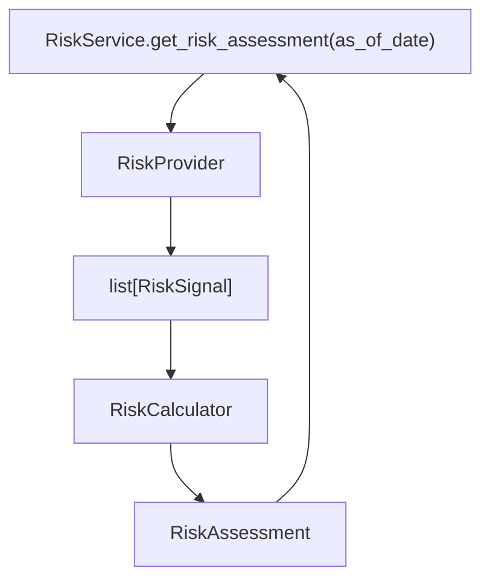

# Epic 013: Risk Layer

Status: Epic 13 — Frozen

## Goal

Add a provider-neutral Risk Layer so ParakeetNest can capture normalized risk
signals, score them deterministically, and expose an aggregate risk assessment
before the AI Committee reasons over an investment question.

The Risk Layer is research infrastructure only. It does not fetch vendor data
directly, call LLMs, produce trading recommendations, or implement automatic
trading.

## Scope

Epic 13 completed the core Risk Layer surface:

- provider-neutral risk domain models;
- `RiskProvider` abstraction for normalized risk signal evidence;
- deterministic `RiskCalculator` scoring and aggregation;
- `RiskService` orchestration over provider and calculator abstractions;
- network-free tests for models, provider contracts, calculator behavior, and
  service delegation.

Out of scope for Epic 13:

- live provider adapters;
- context provider integration;
- prompt rendering;
- persistence;
- recommendation generation;
- automatic trading.

## Completed Stories

### Story 13.1: Risk Domain Models

Completed. Added provider-neutral domain models for risk levels, categories,
signals, aggregate assessments, and compact summaries.

The model surface includes:

- `RiskLevel`;
- `RiskCategory`;
- `RiskSignal`;
- `RiskAssessment`;
- `RiskSummary`.

Models normalize enum values, stable text fields, scores, evidence, metadata,
and deterministic signal ordering without embedding provider-specific fields.

### Story 13.2: RiskProvider Abstraction

Completed. Added `RiskProvider`, a structural protocol for provider-neutral
risk evidence.

Providers return normalized `RiskSignal` lists through:

```text
get_risk_signals(subject=None, as_of_date=None) -> list[RiskSignal]
```

The provider boundary contains no direct dependency on Yahoo Finance, SEC,
Macro, Sector Rotation, Valuation, database, network, LLM, or trading modules.

### Story 13.3: RiskCalculator

Completed. Added `RiskCalculator`, the deterministic calculation boundary for
risk scoring and aggregation.

`RiskCalculator` owns:

- score clamping;
- signal severity normalization;
- aggregate score calculation;
- aggregate level classification;
- empty-signal default handling;
- summary generation.

Calculation rules stay inside the calculator and are not duplicated by the
service or provider.

### Story 13.4: RiskService

Completed. Added `RiskService`, the public orchestration service for the Risk
Layer.

The service retrieves normalized signals from `RiskProvider` and delegates all
scoring and aggregation to `RiskCalculator`:

```text
RiskProvider
  -> list[RiskSignal]
  -> RiskCalculator
  -> RiskAssessment
```

The service does not contain business logic, LLM logic, provider-specific
logic, fallback scoring, or recommendation logic.

## Architecture Pattern



The layer follows the Investment Intelligence Layer Pattern from ADR-003:

```text
provider -> service -> calculator -> assessment
```

For Epic 13, the implemented components are:

- models: provider-neutral data structures in `models.py`;
- provider: signal evidence protocol in `provider.py`;
- calculator: deterministic scoring and aggregation in `calculator.py`;
- service: orchestration-only boundary in `service.py`.

Dependency direction remains inward toward stable abstractions and domain
models. Vendor adapters and upstream source-specific details stay outside this
package.

## Key Design Decisions

- Providers return `list[RiskSignal]`, not aggregate risk assessments.
- `RiskCalculator` owns all scoring, severity normalization, aggregation, and
  summary rules.
- `RiskService` only orchestrates provider output into calculator input.
- The Risk Layer contains no LLM logic.
- The Risk Layer contains no trading recommendations and no automatic trading.
- Domain models are provider-neutral and avoid vendor, ticker, API, database,
  prompt, recommendation, and trading-specific fields.
- Provider and calculator exceptions propagate through the service rather than
  being converted into hidden fallback assessments.

## Public API Summary

The public risk package exports:

- `RiskAssessment`;
- `RiskCalculator`;
- `RiskCategory`;
- `RiskLevel`;
- `RiskProvider`;
- `RiskService`;
- `RiskSignal`;
- `RiskSummary`.

`RiskProvider` exposes:

```text
get_risk_signals(subject=None, as_of_date=None) -> list[RiskSignal]
```

`RiskCalculator` exposes:

```text
calculate(signals, as_of_date=None) -> RiskAssessment
```

`RiskService` exposes:

```text
get_risk_assessment(as_of_date=None) -> RiskAssessment
```

## Test Coverage Summary

Epic 13 is covered by:

- `tests/test_risk_models.py`;
- `tests/test_risk_provider.py`;
- `tests/test_risk_calculator.py`;
- `tests/test_risk_service.py`.

Coverage includes:

- stable enum values;
- model normalization and immutability;
- provider-neutral field boundaries;
- provider protocol shape;
- absence of provider-specific imports;
- score-to-level thresholds;
- score clamping;
- aggregate score calculation;
- empty-signal behavior;
- severe-signal aggregate behavior;
- metadata and evidence preservation;
- service delegation from provider to calculator;
- empty provider output;
- provider exception propagation;
- calculator exception propagation;
- `as_of_date` forwarding;
- package exports.

## Freeze Status

Epic 13 — Frozen.

The v1 Risk Layer contract is frozen around provider-neutral models, a
signal-returning provider abstraction, deterministic calculator ownership of
business rules, and an orchestration-only service. Future work may add provider
adapters or context integration behind these boundaries, but should not move
calculation logic into the service or introduce LLM or trading behavior into
the Risk Layer.
