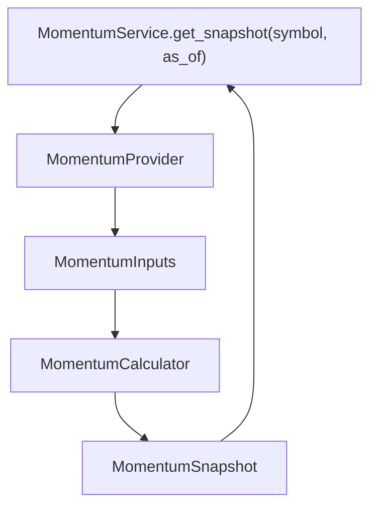

# Epic 015: Momentum Layer

Status: Epic 15 - Frozen

## Goal

Add a provider-neutral Momentum Layer so ParakeetNest can assess price momentum,
relative strength, trend strength, and reversal risk before the AI Committee
reasons over an investment question.

The Momentum Layer is read-only research infrastructure. It does not fetch live
vendor data directly, call LLMs, generate recommendations, implement automatic
trading, or embed provider-specific payloads in domain models.

## Scope

Epic 15 completed the core Momentum Layer surface:

- provider-neutral momentum domain models;
- `MomentumProvider` abstraction for normalized raw momentum inputs;
- deterministic `MomentumCalculator` scoring, regime classification, reversal
  risk classification, confidence scoring, and evidence generation;
- `MomentumService` orchestration over provider and calculator abstractions;
- deterministic `MockMomentumProvider` for tests and local development;
- network-free tests for models, provider contracts, calculator behavior, and
  service delegation.

Out of scope for Epic 15:

- live market-data adapters;
- context-provider integration;
- prompt rendering;
- persistence;
- recommendation generation;
- automatic trading.

## Completed Stories

### Story 15.1: Momentum Models

Completed. Added provider-neutral domain models for momentum regimes, reversal
risk levels, and point-in-time momentum snapshots.

The model surface includes:

- `MomentumRegime`;
- `ReversalRisk`;
- `MomentumSnapshot`.

Models normalize symbols, numeric values, enums, confidence, and evidence
without adding vendor, API, database, LLM, recommendation, or trading fields.

### Story 15.2: Momentum Provider

Completed. Added `MomentumInputs` and `MomentumProvider`, a structural protocol
for raw provider-neutral momentum facts.

Providers return normalized inputs through:

```text
get_momentum_inputs(symbol, as_of=None) -> MomentumInputs
```

The provider boundary owns data access and normalization only. It does not
calculate scores, classify regimes, produce recommendations, or select trading
actions.

### Story 15.3: Momentum Calculator

Completed. Added `MomentumCalculator`, the deterministic calculation boundary
for momentum intelligence.

`MomentumCalculator` owns:

- normalized momentum score calculation;
- momentum regime classification;
- reversal risk classification;
- confidence calculation;
- human-readable evidence generation;
- score and input clamping.

Calculation rules stay inside the calculator and are not duplicated by the
service or provider.

### Story 15.4: Momentum Service

Completed. Added `MomentumService`, the public orchestration boundary for the
Momentum Layer.

The service retrieves normalized inputs from `MomentumProvider` and delegates
all scoring and classification to `MomentumCalculator`:

```text
MomentumProvider
  -> MomentumInputs
  -> MomentumCalculator
  -> MomentumSnapshot
```

The service contains no business logic, provider-specific logic, LLM logic,
recommendation logic, or trading behavior.

### Story 15.5: Test Hardening

Completed. Tests lock the v1.1 Momentum Layer contract around provider-neutral
models, provider protocol shape, deterministic calculator thresholds, service
dependency injection, public package exports, and isolation from concrete data
providers.

### Story 15.6: Documentation and Architecture Freeze

Completed. The Momentum Layer has been reviewed against the established v1.1
intelligence-layer pattern used by Economic Regime, Sector Rotation, Risk, and
Market Breadth.

This freeze confirms:

- provider-neutral architecture;
- explicit dependency injection into the service;
- deterministic calculator ownership of business rules;
- orchestration-only service behavior;
- package exports matching the frozen public API;
- no automatic trading behavior;
- no hard-coded API keys;
- no new functionality added during the freeze pass.

## Architecture Pattern



The layer follows the v1.1 Investment Intelligence Layer Pattern from ADR-003:

```text
provider -> service -> calculator -> snapshot
```

For Epic 15, the implemented components are:

- models: provider-neutral immutable domain structures in `models.py`;
- provider: raw momentum input protocol in `provider.py`;
- calculator: deterministic scoring and classification in `calculator.py`;
- service: orchestration-only application boundary in `service.py`;
- mock provider: deterministic network-free adapter in `mock.py`.

Dependency direction remains inward toward stable abstractions and domain
models. Vendor adapters and upstream source-specific details stay outside this
package.

## Public API Summary

The public momentum package exports:

- `MockMomentumProvider`;
- `MomentumCalculator`;
- `MomentumInputs`;
- `MomentumProvider`;
- `MomentumRegime`;
- `MomentumService`;
- `MomentumSnapshot`;
- `ReversalRisk`.

`MomentumProvider` exposes:

```text
get_momentum_inputs(symbol, as_of=None) -> MomentumInputs
```

`MomentumCalculator` exposes:

```text
calculate(inputs) -> MomentumSnapshot
calculate_score(inputs) -> float
classify_momentum(score) -> MomentumRegime
classify_reversal_risk(inputs) -> ReversalRisk
confidence_for(inputs, momentum_score) -> float
evidence_for(inputs, momentum_regime, reversal_risk) -> tuple[str, ...]
```

`MomentumService` exposes:

```text
get_snapshot(symbol, as_of=None) -> MomentumSnapshot
```

## Package Consistency Review

Momentum is consistent with the frozen v1.1 intelligence packages:

- Economic Regime keeps classification rules in a deterministic classifier and
  orchestration in a service.
- Sector Rotation keeps provider data, calculation, service orchestration, and
  package exports separated.
- Risk keeps scoring and aggregation inside a calculator and exposes only an
  orchestration service.
- Market Breadth keeps provider snapshots, deterministic recalculation, service
  orchestration, context integration, and exports separated.

Momentum intentionally stops at the service boundary in Epic 15. Context
provider integration is out of scope for this freeze and should be added later
without moving calculation logic into the service.

## Test Coverage Summary

Epic 15 is covered by:

- `tests/test_momentum_models.py`;
- `tests/test_momentum_provider.py`;
- `tests/test_momentum_calculator.py`;
- `tests/test_momentum_service.py`.

Coverage includes:

- stable enum values;
- model normalization and immutability;
- provider-neutral field boundaries;
- provider protocol shape;
- absence of provider-specific imports;
- deterministic mock provider behavior;
- score normalization and clamping;
- momentum regime threshold boundaries;
- reversal risk boundary behavior;
- confidence normalization and rounding;
- evidence generation;
- service dependency injection;
- provider and calculator delegation;
- orchestration-only service behavior;
- package exports.

## Freeze Status

Epic 15 - Frozen.

The v1.1 Momentum Layer contract is frozen around provider-neutral models, a
raw-input provider abstraction, deterministic calculator ownership of business
rules, and an orchestration-only service. Future work may add live provider
adapters or context integration behind these boundaries, but should not add
LLM, recommendation, or trading behavior to the Momentum Layer.
