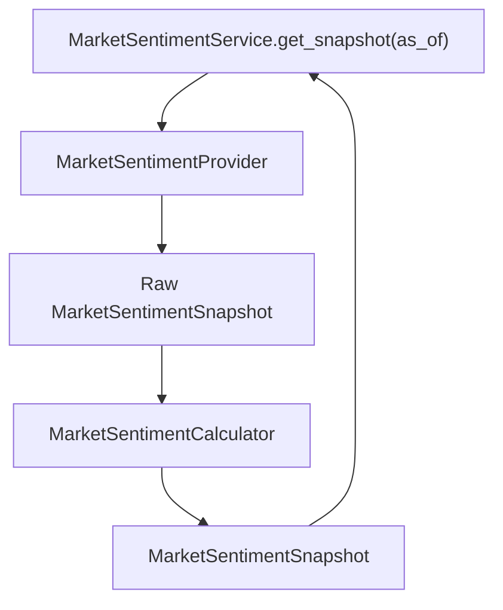

# Epic 016: Market Sentiment Layer

Status: Epic 16 - Completed

## Purpose

Add a provider-neutral Market Sentiment Layer so ParakeetNest can assess market
fear, neutrality, and greed from structured market indicators before the AI
Committee reasons over an investment question.

The Market Sentiment Layer is deterministic research infrastructure. It does
not fetch live vendor data directly, analyze news, analyze social media, call
LLMs, generate recommendations, implement automatic trading, or embed
provider-specific payloads in domain models.

## Scope

Epic 16 adds the core Market Sentiment Layer surface:

- provider-neutral sentiment domain models;
- `MarketSentimentProvider` abstraction for raw structured sentiment snapshots;
- deterministic `MarketSentimentCalculator` scoring, regime classification,
  confidence scoring, and signal normalization;
- `MarketSentimentService` orchestration over provider and calculator
  abstractions;
- deterministic `MockMarketSentimentProvider` for tests and local development;
- network-free tests for models, provider contracts, calculator behavior, and
  service delegation.

## Non-goals

Out of scope for Epic 16:

- news sentiment analysis;
- social-media sentiment analysis;
- LLM sentiment analysis or opinion generation;
- live market-data adapters;
- context-provider integration;
- prompt rendering;
- persistence;
- recommendation generation;
- automatic trading.

## Architecture



The layer follows the frozen v1.1 Investment Intelligence Layer Pattern:

```text
provider -> service -> calculator -> snapshot
```

For Epic 16, the implemented components are:

- models: provider-neutral immutable domain structures in `models.py`;
- provider: raw sentiment snapshot protocol in `provider.py`;
- calculator: deterministic normalization, scoring, and classification in
  `calculator.py`;
- service: orchestration-only application boundary in `service.py`;
- mock provider: deterministic network-free adapter in `mock.py`.

Dependency direction remains inward toward stable abstractions and domain
models. Vendor adapters and source-specific details stay outside this package.

## Models

The public model surface includes:

- `SentimentRegime`;
- `SentimentSignal`;
- `MarketSentimentSnapshot`.

`SentimentRegime` values are:

- `EXTREME_FEAR`;
- `FEAR`;
- `NEUTRAL`;
- `GREED`;
- `EXTREME_GREED`.

`SentimentSignal` captures one structured market indicator with a raw value,
normalized 0-100 score, weight, and optional description.

`MarketSentimentSnapshot` captures the point-in-time aggregate score,
confidence, regime, component signals, and optional deterministic summary.

## Provider Abstraction

`MarketSentimentProvider` exposes:

```text
get_sentiment_snapshot(as_of=None) -> MarketSentimentSnapshot
```

Providers own data access and raw structured signal assembly only. They do not
calculate final aggregate scores, classify final regimes, produce
recommendations, select trading actions, or call other intelligence services.

Provider snapshots include provider-neutral structured signals for:

- VIX level;
- VIX trend;
- Put/Call proxy;
- Credit stress;
- Safe-haven demand;
- Risk appetite;
- optional signal weights.

## Calculator

`MarketSentimentCalculator` owns all business rules:

- normalizing raw sentiment indicators to 0-100 scores;
- calculating a weighted 0-100 overall score;
- classifying sentiment regimes;
- computing confidence from signal coverage, agreement, and conviction;
- generating a short deterministic summary.

Regime thresholds are inclusive at the lower bound:

```text
0-20     EXTREME_FEAR
20-40    FEAR
40-60    NEUTRAL
60-80    GREED
80-100   EXTREME_GREED
```

The service and provider do not duplicate calculator rules.

## Future Data Sources

Future adapters can implement `MarketSentimentProvider` using structured market
data sources such as volatility indexes, options-derived proxies, credit-spread
series, Treasury or currency safe-haven proxies, and risk-asset relative
performance.

Future adapters must preserve the provider-neutral contract and must not add
news analysis, social-media analysis, LLM analysis, recommendations, or trading
behavior to this layer.

## Validation Checklist

- Provider-neutral package created at `src/parakeetnest/intelligence/sentiment/`.
- Public API exported from `sentiment/__init__.py`.
- Deterministic mock provider added.
- Calculator returns a 0-100 score.
- Regime classification thresholds covered by tests.
- Score normalization clamps boundaries.
- Confidence normalization clamps boundaries.
- Service delegates to provider and calculator only.
- Provider abstraction avoids concrete upstream providers.
- No external libraries introduced.
- No real APIs implemented.
- No news, social-media, or LLM sentiment analysis implemented.
- No automatic trading behavior implemented.

## Test Coverage Summary

Epic 16 is covered by:

- `tests/test_sentiment_models.py`;
- `tests/test_sentiment_provider.py`;
- `tests/test_sentiment_calculator.py`;
- `tests/test_sentiment_service.py`.

Coverage includes:

- stable enum values;
- model normalization and immutability;
- provider-neutral field boundaries;
- provider protocol shape;
- absence of provider-specific imports;
- deterministic mock provider behavior;
- score normalization and clamping;
- sentiment regime threshold boundaries;
- confidence normalization;
- service dependency injection;
- provider and calculator delegation;
- orchestration-only service behavior;
- package exports.
