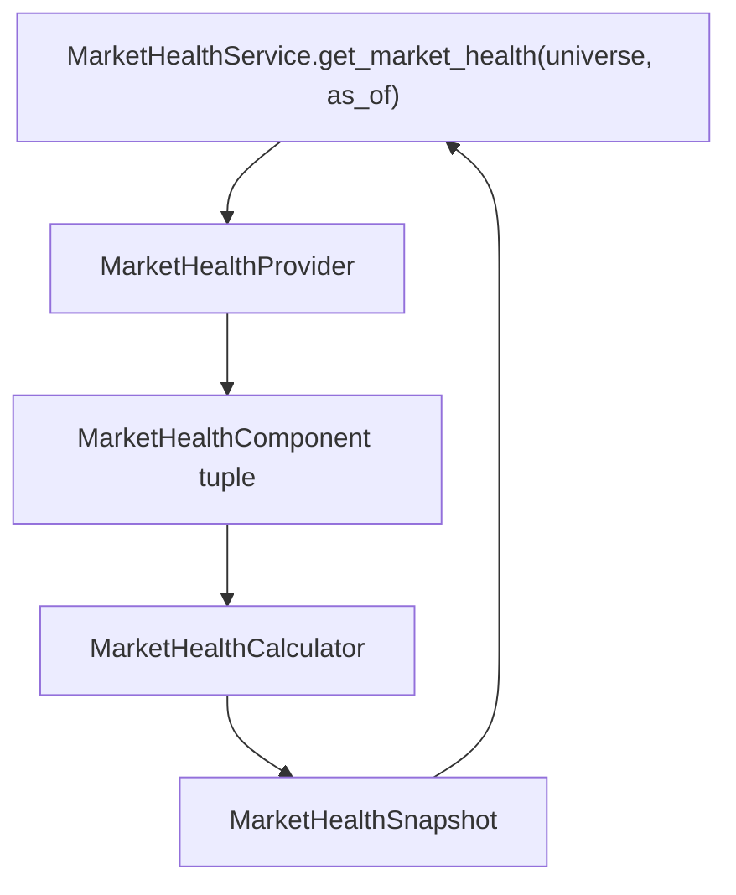

# Epic 017: Market Health Layer

Status: Epic 17 - Completed

## Purpose

Add a provider-neutral Market Health Layer so ParakeetNest can summarize the
condition of the market before later committee integration. The layer combines
existing investment intelligence signals into one deterministic snapshot with a
health state, normalized score, confidence, component evidence, positives,
negatives, and warnings.

The committee remembers before it reasons. Epic 17 preserves that principle by
making market health a structured intelligence artifact, not a free-form
opinion.

## Non-goals

Out of scope for Epic 17:

- automatic trading;
- recommendation generation;
- Committee or context-provider integration;
- external data source calls;
- vendor-specific payloads in domain models;
- persistence;
- LLM reasoning;
- changes to Epic 11-16 domain semantics.

## Architecture



The layer follows the frozen Investment Intelligence Layer pattern:

```text
provider -> service -> calculator -> snapshot
```

Implemented package:

```text
src/parakeetnest/intelligence/health/
```

Files:

- `models.py`: provider-neutral market health domain models;
- `calculator.py`: deterministic weighting, score normalization, state
  classification, confidence, and component summaries;
- `provider.py`: provider protocol for component retrieval;
- `mock.py`: deterministic network-free mock provider;
- `service.py`: orchestration-only application boundary;
- `__init__.py`: public API exports.

## Domain Models

`MarketHealthState` values:

- `ROBUST`
- `HEALTHY`
- `FRAGILE`
- `DETERIORATING`
- `STRESSED`
- `UNKNOWN`

`HealthComponentState` values:

- `POSITIVE`
- `NEUTRAL`
- `NEGATIVE`
- `WARNING`
- `UNKNOWN`

`MarketHealthComponent` captures one component:

- component name;
- component state;
- optional normalized score;
- optional weight;
- supporting evidence;
- provider-neutral metadata.

`MarketHealthSnapshot` captures:

- `as_of`;
- `universe`;
- `health_state`;
- `health_score`;
- `confidence`;
- component list;
- positives;
- negatives;
- warnings;
- provider-neutral metadata.

## Calculator Logic

`MarketHealthCalculator` accepts explicit `MarketHealthComponent` inputs or
simplified dependency-like snapshots for:

- economic regime;
- sector rotation;
- risk;
- market breadth;
- momentum;
- sentiment.

Default weights:

```text
economic_regime: 0.20
risk:            0.20
breadth:         0.20
momentum:        0.20
sentiment:       0.10
sector_rotation: 0.10
```

Weighted scoring:

- component scores are normalized to `0.0` through `1.0`;
- unavailable or `UNKNOWN` components are excluded;
- partial data is normalized by available component weight;
- no available data returns score `0.0`, confidence `0.0`, and state `UNKNOWN`.

Health state thresholds:

```text
>= 0.80 ROBUST
>= 0.65 HEALTHY
>= 0.45 FRAGILE
>= 0.30 DETERIORATING
<  0.30 STRESSED
```

Confidence is proportional to availability across the six default components:

```text
available default components / six default components
```

## Provider Pattern

`MarketHealthProvider` exposes:

```text
get_market_health_components(universe="US", as_of=None)
    -> tuple[MarketHealthComponent, ...]
```

Providers own component assembly only. They do not classify aggregate health,
generate recommendations, call external APIs from this package, persist data,
or integrate with the Committee.

`MockMarketHealthProvider` returns deterministic sample components for tests and
local development.

## Testing Strategy

Epic 17 is covered by:

- `tests/test_health_models.py`;
- `tests/test_health_calculator.py`;
- `tests/test_health_provider.py`;
- `tests/test_health_service.py`.

Coverage includes:

- stable enum values;
- model normalization and immutability;
- provider-neutral field boundaries;
- score-to-state threshold mapping;
- weighted score calculation;
- partial component normalization;
- insufficient data returning `UNKNOWN`;
- deterministic mock provider output;
- service provider and calculator delegation;
- populated positives, negatives, and warnings;
- public package exports.

## Completion Checklist

- [x] Package created at `src/parakeetnest/intelligence/health/`.
- [x] Provider-neutral models added.
- [x] Deterministic calculator added.
- [x] Provider abstraction added.
- [x] Deterministic mock provider added.
- [x] Service boundary added.
- [x] Tests added for models, calculator, provider, and service.
- [x] Documentation added.
- [x] Epic index updated.
- [x] No external data source calls added.
- [x] No Committee integration added.
- [x] No automatic trading behavior added.
