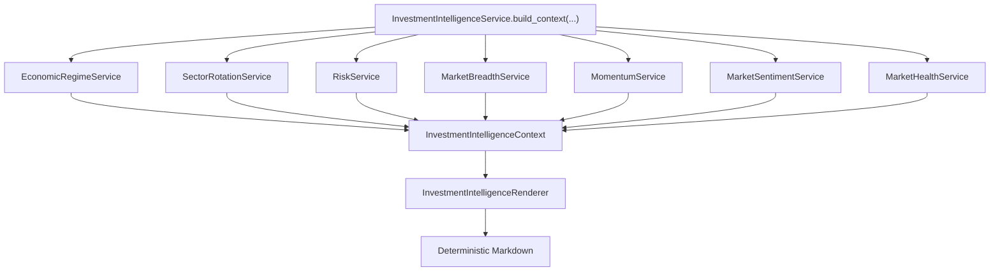

# Epic 018: Investment Intelligence Context

Status: Epic 18 - Completed

## Purpose

Create a unified Investment Intelligence Context layer that aggregates the
completed intelligence signals into one committee-consumable object.

The committee remembers before it reasons. Epic 18 makes that memory easier to
consume by gathering Economic Regime, Sector Rotation, Risk, Market Breadth,
Momentum, Market Sentiment, and Market Health into a single deterministic
context boundary.

## Why One Context

The Committee should eventually depend on one `InvestmentIntelligenceContext`
instead of seven separate services because:

- one dependency keeps committee orchestration focused on reasoning, not data
  assembly;
- one context object gives the Investment Secretary a single memory artifact to
  persist or retrieve;
- one renderer creates stable prompt-ready Markdown without coupling prompts to
  seven service APIs;
- one aggregation boundary preserves the existing signal services and avoids
  duplicating signal logic.

Epic 18 does not replace the underlying intelligence services. It composes
their completed outputs.

## Architecture



The service is orchestration-only:

```text
existing intelligence services -> InvestmentIntelligenceService -> context
context -> InvestmentIntelligenceRenderer -> Markdown
```

No signal calculation is implemented in Epic 18. Economic regime, sector
rotation, risk, breadth, momentum, sentiment, and health logic remain owned by
their existing packages.

## Files Added

Package:

```text
src/parakeetnest/intelligence/context/
```

Files:

- `models.py`: `InvestmentIntelligenceContext` aggregate dataclass;
- `service.py`: constructor-injected aggregation service;
- `renderer.py`: deterministic Markdown renderer;
- `mock.py`: deterministic sample context service;
- `__init__.py`: public API exports.

Tests:

- `tests/test_investment_intelligence_context_models.py`;
- `tests/test_investment_intelligence_context_service.py`;
- `tests/test_investment_intelligence_context_renderer.py`;
- `tests/test_investment_intelligence_context_mock.py`.

## Testing Strategy

Coverage includes:

- direct construction of `InvestmentIntelligenceContext`;
- aggregation service delegation to all seven underlying services exactly once;
- deterministic renderer output containing all seven sections;
- graceful rendering of optional fields;
- deterministic mock service output;
- public package exports.

The full test suite validates that existing public interfaces from Epics 11-17
remain intact.

## Out of Scope

Epic 18 intentionally excludes:

- Committee integration;
- Agent prompt integration;
- Meeting integration;
- automatic trading;
- recommendation generation;
- persistence;
- new external data providers;
- duplicated signal calculation logic.

Future epics can attach the Committee, Agent prompts, and Meeting flow to this
single context boundary.
