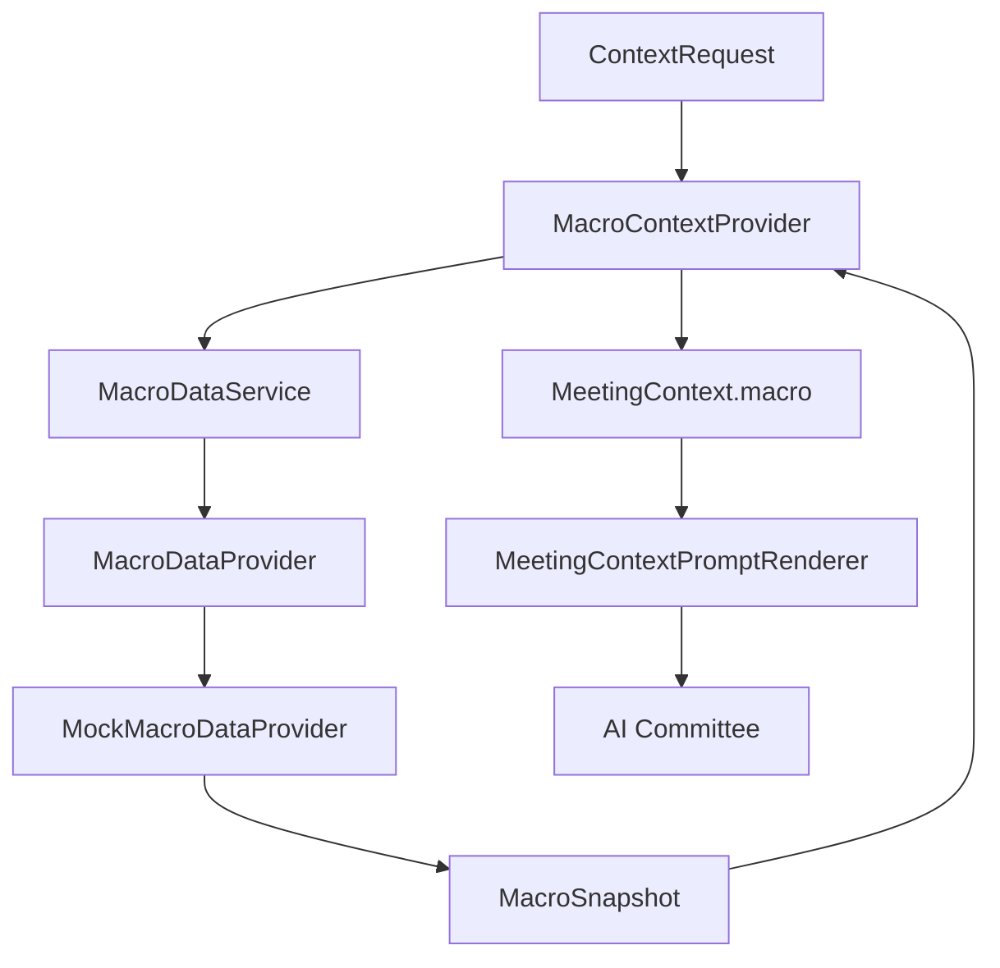

# Epic 010: Macro Layer

## Goal

Add a provider-neutral Macro Layer so ParakeetNest can include economic
conditions in committee research before Xixi, Dongdong, Yoyo, and the Chairman
reason about an investment question.

Epic 10 completes the first service-backed macro context path. The layer
normalizes economic indicators, observations, series, and snapshots behind a
small provider abstraction, then adapts the resulting snapshot into
`MeetingContext.macro`.

The completed scope includes:

- provider-neutral macro domain models;
- `MacroDataProvider` abstraction;
- deterministic `MockMacroDataProvider`;
- `MacroDataService`;
- `MacroContextProvider`;
- prompt rendering through the existing Context Layer;
- network-free tests for models, provider contract, mock provider, service
  delegation, context integration, and rendering.

## Architecture Overview



Dependency direction remains one-way:

```text
concrete provider -> provider protocol and domain models -> service
  -> context provider -> ContextService -> prompt renderer -> committee
```

The committee receives rendered macro evidence only. It does not import macro
providers, select providers, parse external payloads, or make trading actions.

## Macro Domain Models

The Macro Layer owns provider-neutral models in `src/parakeetnest/macro`:

- `MacroCategory`: economy-facing categories such as growth, inflation, labor,
  rates, credit, housing, consumer, trade, fiscal, money, sentiment, and other.
- `MacroFrequency`: daily, weekly, monthly, quarterly, annual, and irregular.
- `MacroUnit`: stable units such as index, percent, percentage point, basis
  point, currency, persons, count, thousands, millions, billions, ratio, and
  other.
- `MacroIndicator`: normalized metadata for one economic indicator.
- `MacroObservation`: one period value with optional release and revision
  timestamps.
- `MacroSeries`: ordered observations for one indicator.
- `MacroSnapshot`: point-in-time collection of macro series plus notes.

Models normalize stable fields at construction time. Indicator IDs are stripped
and lowercased, regions are uppercased, enum values are coerced, observations
are sorted chronologically, and snapshot series are sorted by indicator ID.

Context-facing macro models live in `src/parakeetnest/context/models.py`:

- `MacroSnapshot`;
- `MeetingContext.macro`.

The separation keeps provider-facing economic models independent from the
prompt-facing context shape.

## Macro Provider Abstraction

`MacroDataProvider` is the provider-neutral contract for macroeconomic data. It
defines three operations:

- `get_series(indicator_id, start_date=None, end_date=None) -> MacroSeries`
- `get_latest(indicator_id) -> MacroObservation | None`
- `get_snapshot(indicator_ids, as_of_date=None) -> MacroSnapshot`

Concrete providers own source-specific behavior. They should handle vendor
SDKs, HTTP clients, authentication, payload parsing, provider quirks, retry
policy, and error translation before normalized macro models cross the provider
boundary.

## MockMacroDataProvider

`MockMacroDataProvider` is the deterministic v1 macro provider. It supports
local development and tests without network access or API keys.

Current fixture indicators include:

- `fed_funds_rate`;
- `treasury_10y_yield`;
- `cpi_yoy`;
- `core_cpi_yoy`;
- `unemployment_rate`;
- `nonfarm_payrolls`;
- `gdp_growth`;
- `m2_growth`.

Unknown indicator IDs return a provider-neutral fallback series with category,
frequency, and unit set to `other` rather than leaking provider errors into the
committee path.

## MacroDataService

`MacroDataService` is the application entry point for macro data lookups. It
depends on `MacroDataProvider`, not on concrete providers.

Current responsibilities:

- expose provider-neutral operations for series, latest observation, and
  snapshots;
- delegate retrieval to the configured provider;
- keep callers unaware of provider selection details;
- provide a future home for caching, fallback, freshness policy, source
  attribution, and provider-specific error mapping.

The service does not render prompts, call LLMs, import live provider SDKs, write
to SQLite, or execute trades.

## MacroContextProvider

`MacroContextProvider` adapts `MacroDataService` into `MeetingContext.macro`.
It contributes when `ContextRequest.include_macro` is enabled.

For each request, it:

- converts `request.as_of` into an optional snapshot date;
- requests a macro snapshot for the default research indicators;
- renders latest observations into committee-readable indicator lines grouped
  by interest rates, inflation, labor market, and growth;
- preserves snapshot notes as context data-quality notes;
- returns a `ContextProviderResult` with source metadata
  `{"source": "macro_data_service"}`.

The provider is registered by application bootstrap and can participate in the
normal `ContextService` assembly path.

## Context Layer Integration

Macro context follows the same Context Provider Pattern as market data, news,
SEC filings, financial statements, and valuation:

```text
ContextRequest
  -> ContextService
  -> MacroContextProvider
  -> MacroDataService
  -> MacroDataProvider
  -> MockMacroDataProvider
  -> MacroSnapshot
  -> MeetingContext.macro
  -> MeetingContextPromptRenderer
  -> AI Committee
```

`MeetingContextPromptRenderer` renders macro context under `## Macro`, including
snapshot metadata, observed date, and indicator lines. Missing macro context
renders explicitly as unavailable rather than inventing economic evidence.

## Testing Strategy

Epic 10 keeps the test suite network-free by default.

Test coverage includes:

- domain model enum coverage and normalization;
- chronological ordering of observations;
- snapshot sorting and note cleanup;
- provider abstraction contract shape;
- mock provider deterministic fixtures, date filtering, latest observation, and
  unknown-indicator behavior;
- service delegation to a provider protocol implementation;
- context provider support checks, snapshot date forwarding, rendered indicator
  groups, metadata, and data quality notes;
- application bootstrap registration;
- context rendering for macro snapshots;
- import-boundary checks that keep concrete provider concerns away from context
  and service layers.

## Future Provider Candidates

The v1 Macro Layer is provider-neutral and ready for live providers behind the
existing contract. Likely candidates:

- FRED: broad U.S. economic time series, rates, inflation, labor, money, and
  growth indicators.
- BEA: GDP, national accounts, personal income, industry accounts, and regional
  economic data.
- BLS: labor market, CPI, PPI, wages, productivity, and employment statistics.
- Treasury: yield curve, Treasury rates, auction data, and fiscal data.
- ECB: euro area rates, monetary aggregates, inflation, credit, and financial
  market statistics.

Future providers should preserve the same dependency rule: external source
payloads stop at the provider boundary, and the committee receives only
provider-neutral context.
