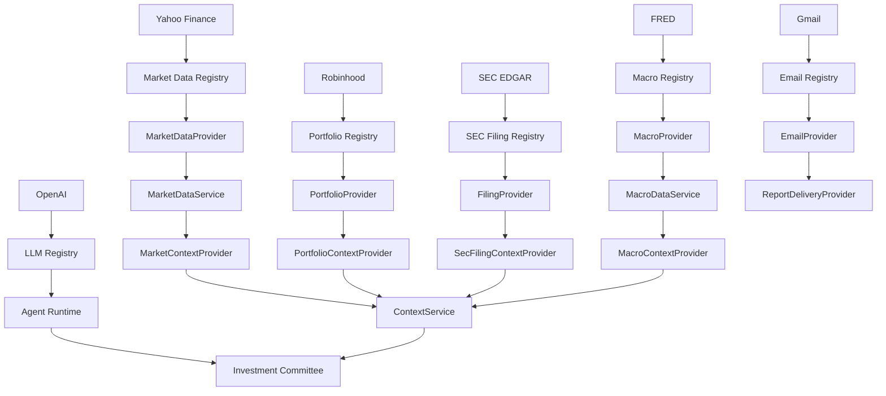

# End-to-End Provider Integration

ParakeetNest keeps live providers behind provider-neutral registries. The
committee receives rendered context and never imports OpenAI, Yahoo Finance,
Robinhood, SEC EDGAR, FRED, or Gmail implementations directly.

## Required API Keys And Secrets

Start from `.env.example` and fill values only in a local `.env` file:

- `OPENAI_API_KEY`: required when `llm.provider = "openai"`.
- `FRED_API_KEY`: required when `macro.provider = "fred"`.
- `GOOGLE_APPLICATION_CREDENTIALS`: path to Gmail OAuth client credentials.
- `PARAKEETNEST_GMAIL_TOKEN_PATH`: path to the authorized Gmail OAuth token.
- `SEC_USER_AGENT`: SEC-compliant identity string, including contact info.
- `ROBINHOOD_SESSION_TOKEN`: preferred when available for Robinhood.
- `ROBINHOOD_USERNAME` and `ROBINHOOD_PASSWORD`: alternative Robinhood login inputs.

Do not commit real credentials, OAuth tokens, or account identifiers.

## Provider Setup

Use `examples/config-real.toml` as the live-provider example:

```toml
[llm]
provider = "openai"

[market_data]
provider = "yahoo"

[portfolio]
provider = "robinhood"

[sec]
provider = "edgar"

[macro]
provider = "fred"

[email]
provider = "gmail"
```

Before running live integrations, validate configuration only:

```bash
parakeetnest doctor --config examples/config-real.toml
```

The doctor command checks provider IDs, required environment variables, and
local credential file paths. It does not call external APIs.

## Optional Providers

All live providers are opt-in. The default `AppConfig()` stays in mock mode for
local development and tests. You can enable only part of the stack by changing
one provider section at a time, for example `macro.provider = "fred"` while the
rest remains `"mock"`.

## Morning Report

Run a local morning report with explicit tickers:

```bash
python -m parakeetnest.cli.daily_report --mode morning --tickers NVDA AAPL
```

Add archive or output paths as needed:

```bash
python -m parakeetnest.cli.daily_report \
  --mode morning \
  --tickers NVDA AAPL \
  --archive \
  --output reports/morning.md
```

## Evening Report

Run the evening review with the same daily report CLI:

```bash
python -m parakeetnest.cli.daily_report --mode evening --tickers NVDA AAPL
```

To include portfolio context, pass an account id that the configured
`PortfolioProvider` can resolve:

```bash
python -m parakeetnest.cli.daily_report \
  --mode evening \
  --tickers NVDA AAPL \
  --account-id default
```

## Switch Back To Mock Mode

Mock mode is the default. Remove the live-provider config or use provider values
like these:

```toml
[llm]
provider = "mock"

[market_data]
provider = "mock"

[portfolio]
provider = "mock"

[sec]
provider = "mock"

[macro]
provider = "mock"

[email]
provider = "mock"
```

Then validate:

```bash
parakeetnest doctor
```

## Architecture Diagram


